# 2607.27060: Optimising Trotter-Suzuki Simulations of Markovian Open Quantum Systems via Classical Search

Preprint: [arXiv:2607.27060v1 — Optimising Trotter-Suzuki Simulations of Markovian Open Quantum Systems via Classical Search](https://arxiv.org/abs/2607.27060v1)

Published as: [Optimising Trotter-Suzuki Simulations of Markovian Open Quantum Systems via Classical Search](https://doi.org/10.1007/s11128-026-05267-1)

Formal citation: 25, 267 (2026) · DOI `10.1007/s11128-026-05267-1` · Locator `267`

Public status: **Scientific reproduction — independent review pending** · Audit score: **90.00/100**

All eight paper-exact panels and all 32 visible theory sequences were regenerated from verified formulas and a verified integer search. Analytic-reference evidence caps scientific scores at 90; pixel fidelity is scored separately.

## Start Here / 从这里开始

- [中文复现 Note](note/reproduction-note.zh-CN.md)
- [English reproduction note](note/reproduction-note.en.md)
- [Equation-level derivation](docs/DERIVATION.md)
- [Numerical methods](docs/NUMERICAL_METHODS.md)
- [Public evidence index](docs/EVIDENCE_INDEX.md)
- [Comparison policy](docs/COMPARISON_POLICY.md)
- [Scientific consistency report](docs/CONSISTENCY_REPORT.md)
- [Code and run commands](code/README.md)
- [Machine-readable scorecard](outputs/checks/similarity_scorecard.json)
- [Machine-readable completion boundary](outputs/checks/completion_assessment.json)
- [Derivation (equations)](docs/DERIVATION.md)
- [Numerical methods](docs/NUMERICAL_METHODS.md)
- [Lessons learned](docs/LESSONS_LEARNED.md)

## Paper Reference vs Independent Reproduction

Each board contains only the minimum paper excerpt needed for validation and places it beside an independently generated result. Visual agreement is a scientific-region diagnostic, not author-data-level equivalence.

### fig002a comparison comparison

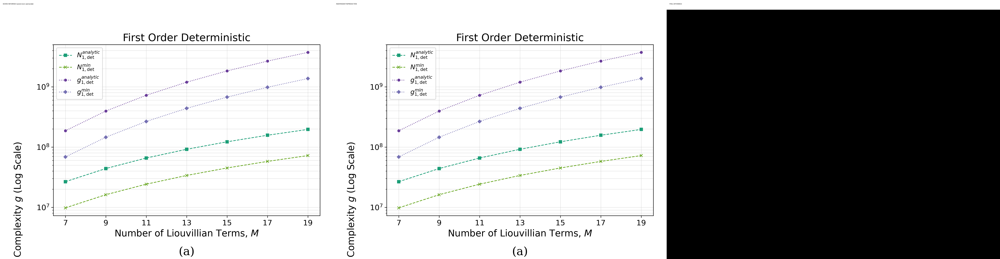

### fig002b comparison comparison

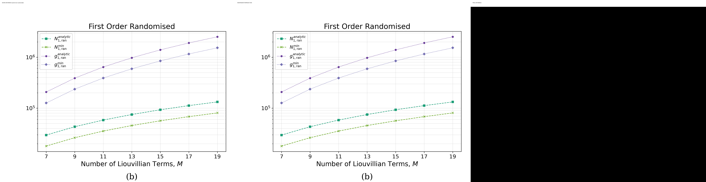

### fig002c comparison comparison

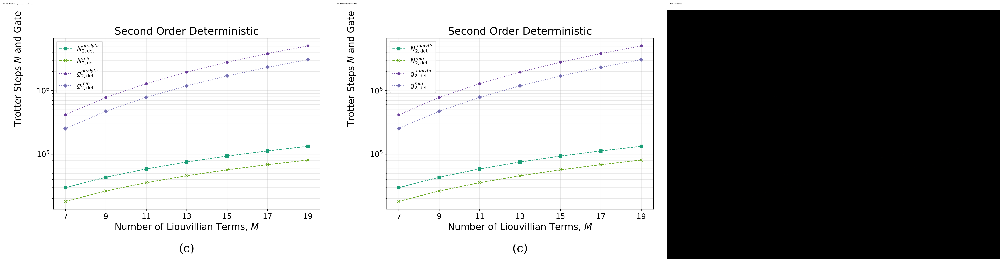

### fig002d comparison comparison

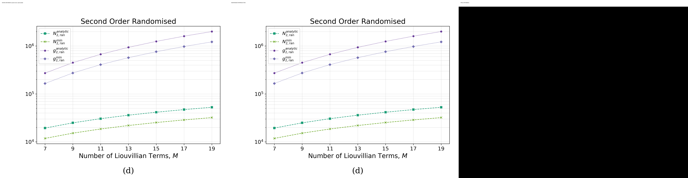

### fig003a comparison comparison

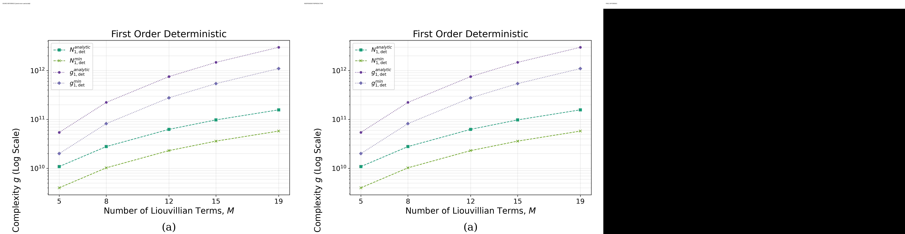

### fig003b comparison comparison

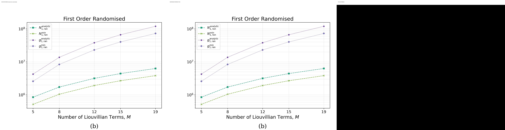

### fig003c comparison comparison

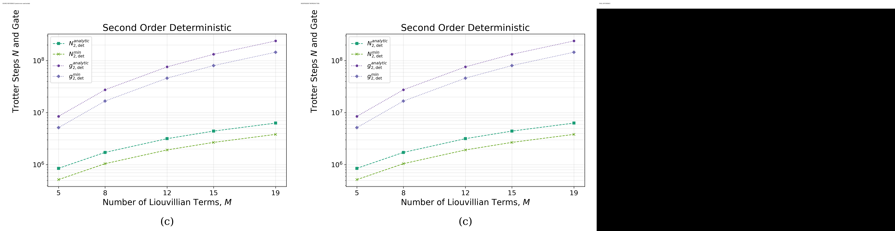

### fig003d comparison comparison

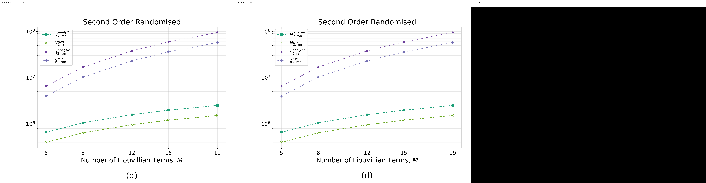

## Quick Run

```bash
python -m venv .venv
source .venv/bin/activate
pip install -r requirements.txt
cd cases/2607.27060/code
python scripts/run_reproduction.py --config config/paper_exact_targets.json --target T-FIG002A --attested-stage final_reproduction
```

Published machine-readable artifacts are kept under [data](outputs/data/), [figures](outputs/figures/), [checks](outputs/checks/).

## Reproduction Boundary

This public case includes paper-derived code, generated data, generated figures, public validation checks, explanatory notes, and 8 limited comparison panels. Those panels use the minimum paper excerpts needed for validation and clearly separate the paper reference from the independent result. The case does not redistribute the paper PDF, arXiv source archive, standalone original figures, EPS paths, digitized source curves, or source-derived point sets.

Remaining limitation: Remaining lifecycle boundaries: artifact_integrity=artifact_valid_with_warnings, parameters=paper_exact, causal_resolution=not_required, independent_review=missing, review_scope=missing, paper_assessment=missing.

Final-parameter rule: final public figures use the paper parameters when feasible. Any reduced-scale, subset, proxy, or blocked target must be labeled explicitly and cannot be presented as a complete reproduction.

## Generated Figures

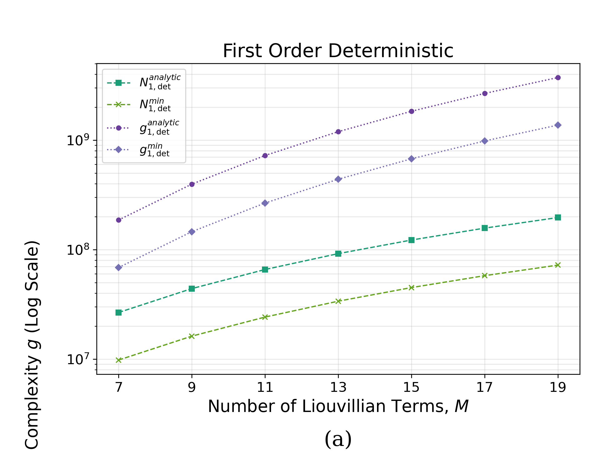

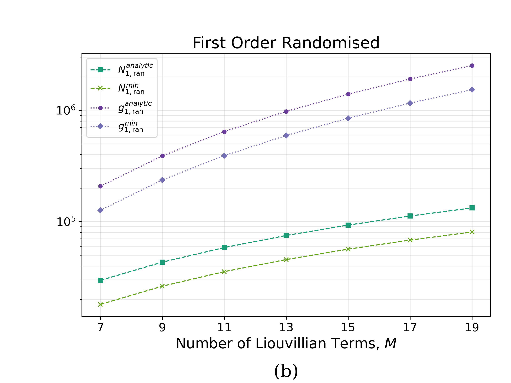

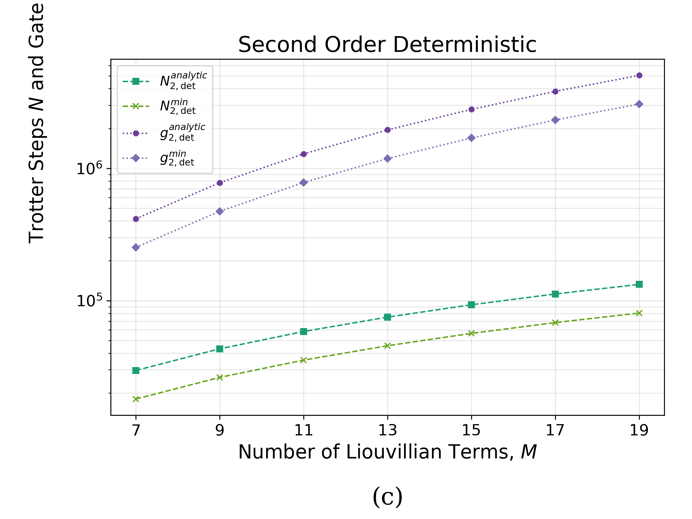

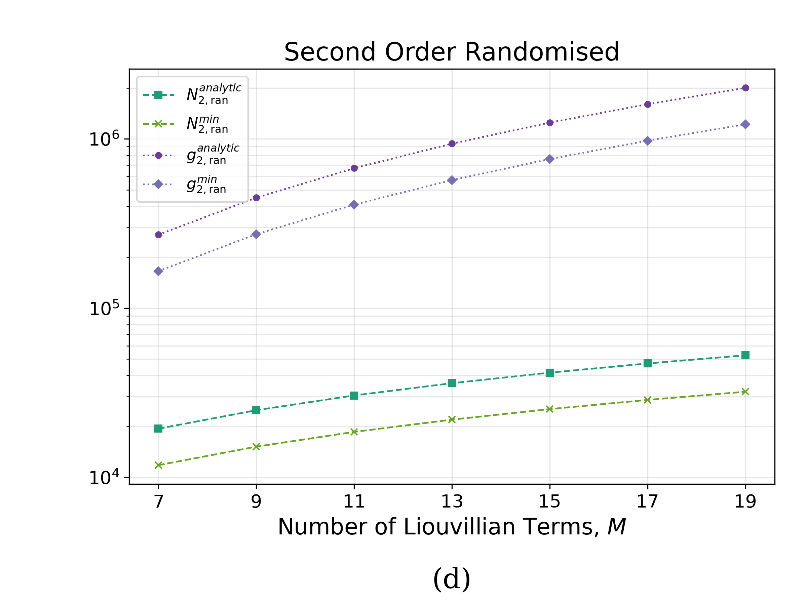

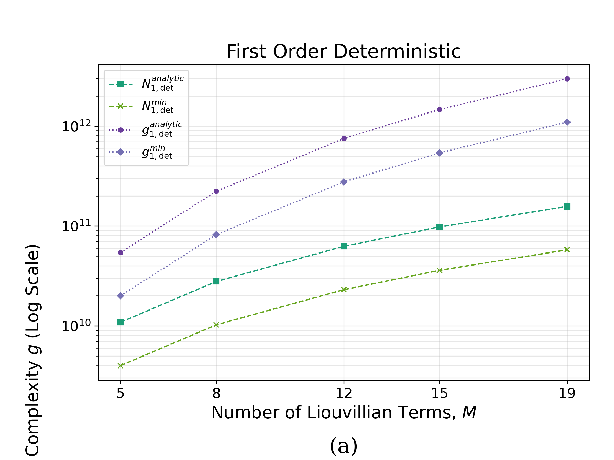

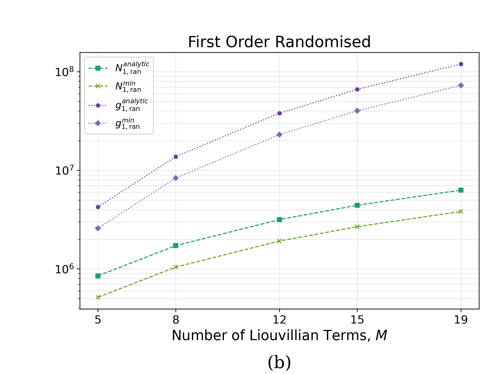

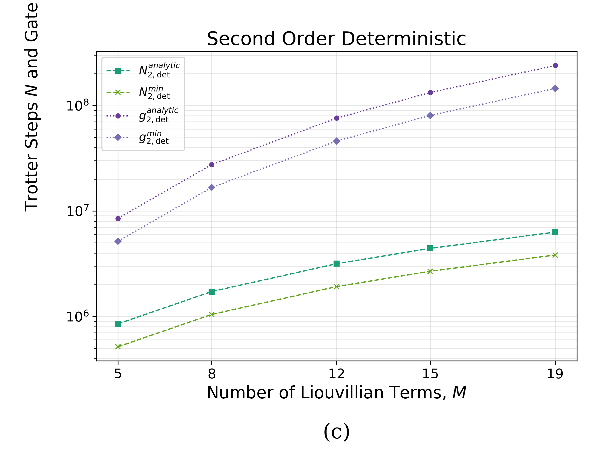

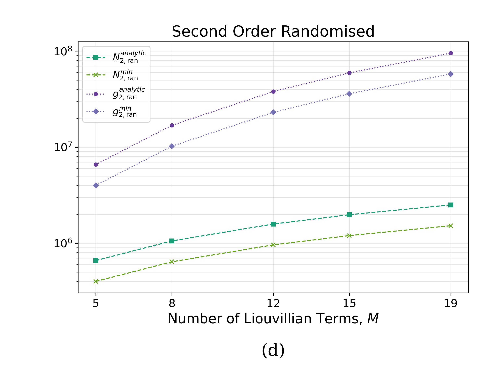

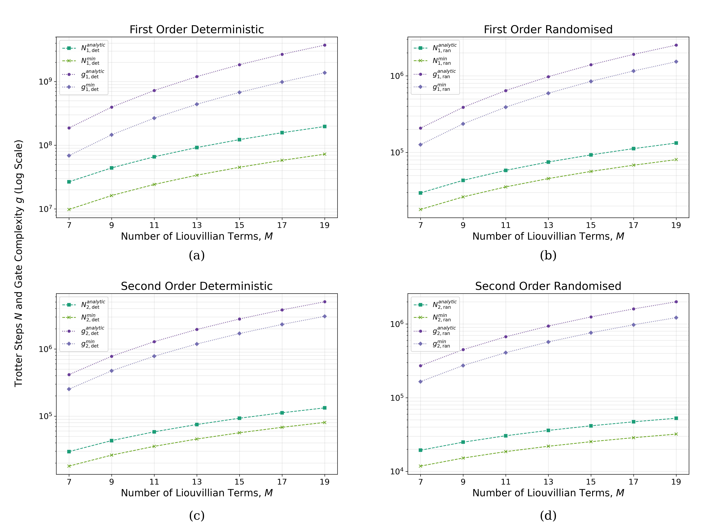

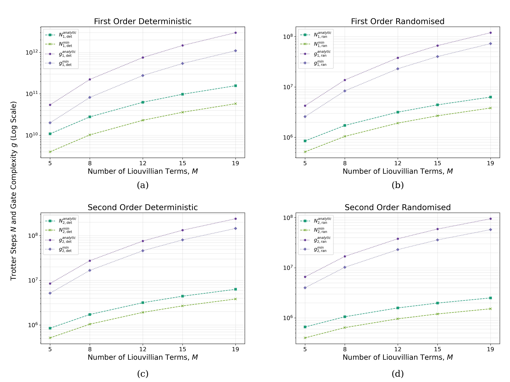
