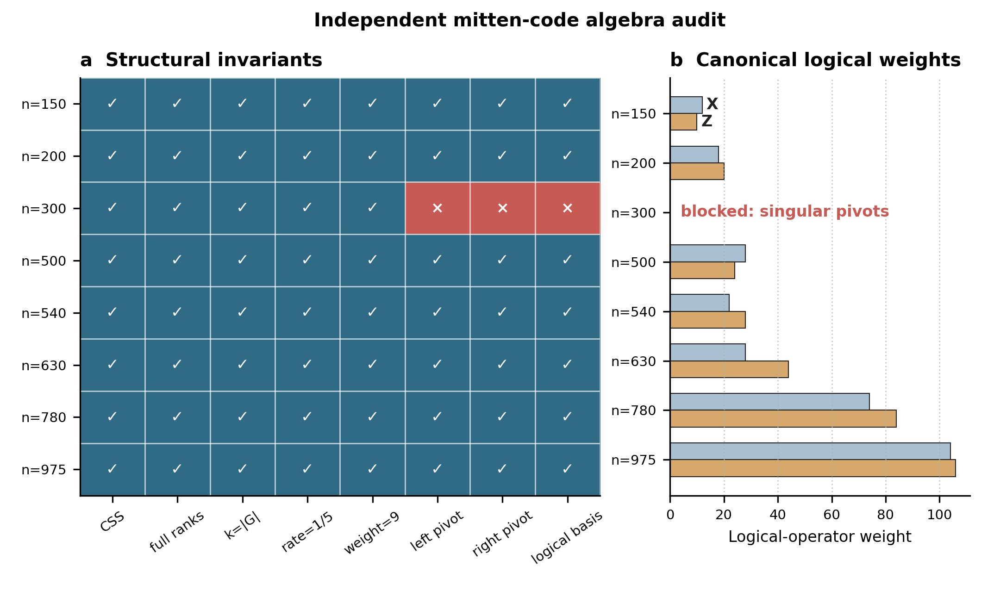
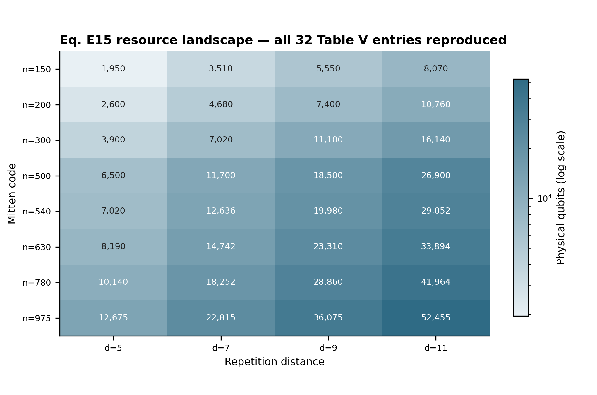
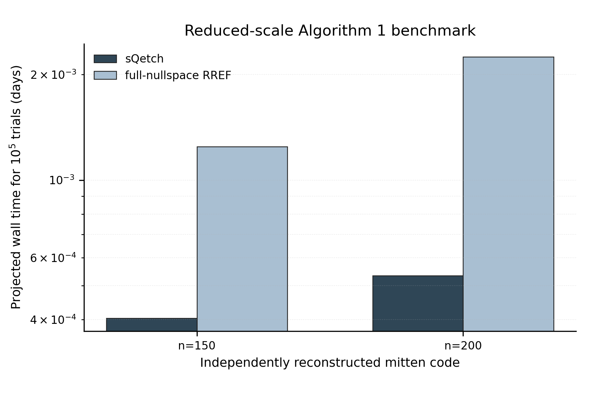
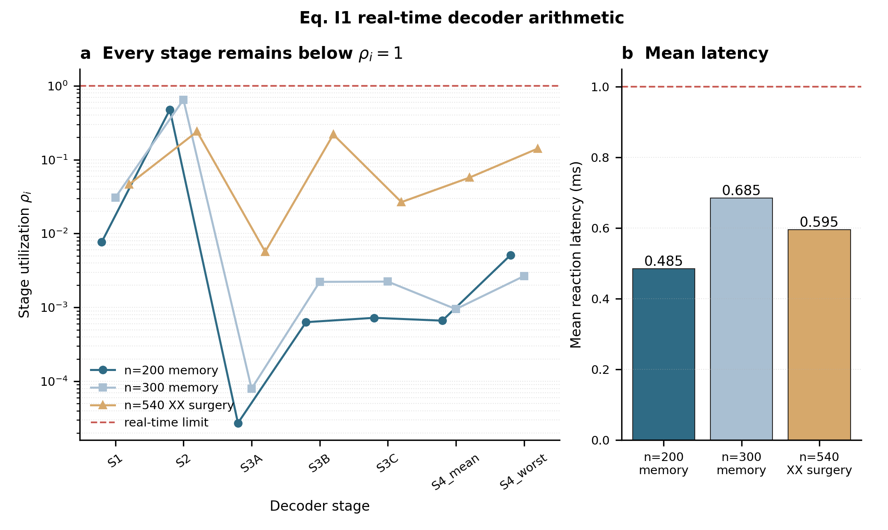

# 2607.28795: High-rate qLDPC processors

Preprint: [arXiv:2607.28795 — High-rate qLDPC processors](https://arxiv.org/abs/2607.28795)

Formal publication: **Not recorded as of 2026-08-04**

Public status: **Historical scientific artifact (4 numerical targets; 2 partially_reproduced, 2 reproduced)** · Audit score: **78.75/100**

Publishes the independently generated numerical artifacts retained by the historical case: 4 public generated data files, 4 public generated figures, and 4 declared numerical targets. The package preserves failed, partial, proxy, and unresolved outcomes instead of upgrading them to completion.

## Start Here / 从这里开始

- [中文复现 Note](note/reproduction-note.zh-CN.md)
- [English reproduction note](note/reproduction-note.en.md)
- [Code and run commands](code/README.md)
- [Machine-readable scorecard](outputs/checks/similarity_scorecard.json)
- [Derivation (equations)](docs/DERIVATION.md)
- [Numerical methods](docs/NUMERICAL_METHODS.md)
- [Lessons learned](docs/LESSONS_LEARNED.md)

## Main Reproduced Results

| Paper item | Reproduced result | Figure | Check |
| --- | --- | --- | --- |
| TABLE_I_VI | Mitten-code algebraic parameters and canonical logical weights. | [PNG](outputs/figures/T001_mitten_algebra_audit.png) | [JSON](outputs/checks/similarity_scorecard.json) |
| TABLE_V | Parallel magic-injection resource counts. | [PNG](outputs/figures/T002_magic_resource_grid.png) | [JSON](outputs/checks/similarity_scorecard.json) |
| FIG8 | Runtime scaling of sketched versus full-nullspace binary RREF. | [PNG](outputs/figures/T003_fig8_reduced.png) | [JSON](outputs/checks/similarity_scorecard.json) |
| TABLE_X | Per-stage utilization and mean reaction time. | [PNG](outputs/figures/T004_realtime_decoder.png) | [JSON](outputs/checks/similarity_scorecard.json) |

### TABLE_I_VI: Mitten-code algebraic parameters and canonical logical weights.



### TABLE_V: Parallel magic-injection resource counts.



### FIG8: Runtime scaling of sketched versus full-nullspace binary RREF.



### TABLE_X: Per-stage utilization and mean reaction time.



## Quick Run

```bash
python -m venv .venv
source .venv/bin/activate
pip install -r requirements.txt
cd cases/2607.28795/code
python scripts/verify_public_artifacts.py
```

### Independent numerical rerun

This command recomputes the scientific numerical arrays from the public equation-based implementation. It does not read a paper image, digitized source curve, or author numerical code; runtime varies from seconds to CPU minutes.

```bash
cd cases/2607.28795/code
python scripts/run_reproduction.py --config config/run_parameters.json --paper-inputs config/paper_inputs.json --group-tables config/group_tables.json
```

Generated files are kept under [data](outputs/data/), [figures](outputs/figures/), and [checks](outputs/checks/).

## Reproduction Boundary

This public case includes paper-derived code, generated data, generated figures, public validation checks, and explanatory notes. It does not redistribute the paper PDF, arXiv source archive, original figures, EPS paths, digitized source curves, source-derived point sets, or source-vs-generated composite panels.

Remaining limitation: Frozen non-final target states: T001=partially_reproduced, T003=partially_reproduced. No source-image comparison panel or digitized source curve is published in this projection.

Final-parameter rule: final public figures use the paper parameters when feasible. Any reduced-scale, subset, proxy, or blocked target must be labeled explicitly and cannot be presented as a complete reproduction.
