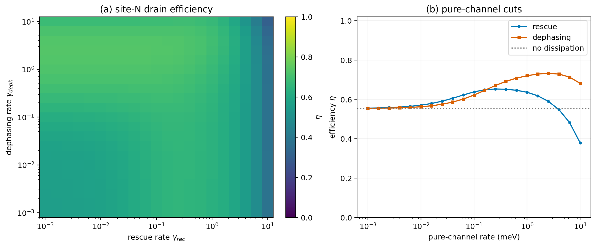
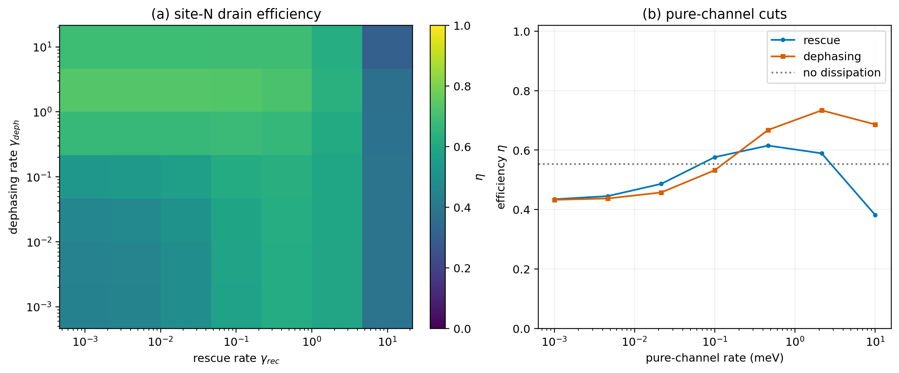

# 2608.05312: Unidirectional Dark-to-Bright Rescue in Cavity-Coupled Quantum Transport

Preprint: [arXiv:2608.05312v1 — Unidirectional Dark-to-Bright Rescue in Cavity-Coupled Quantum Transport](https://arxiv.org/abs/2608.05312)

Formal publication: **Not recorded as of 2026-08-08**

Public status: **Partial scientific reproduction** · Audit score: **83.52/100**

Eleven independent numerical targets reproduce the paper's central features; only the four T011 QCLE benchmark series remain uncovered because indispensable operating parameters are not published.

## Start Here / 从这里开始

- [中文复现 Note](note/reproduction-note.zh-CN.md)
- [English reproduction note](note/reproduction-note.en.md)
- [Equation-level derivation](docs/DERIVATION.md)
- [Numerical methods](docs/NUMERICAL_METHODS.md)
- [Public evidence index](docs/EVIDENCE_INDEX.md)
- [Comparison policy](docs/COMPARISON_POLICY.md)
- [Scientific consistency report](docs/CONSISTENCY_REPORT.md)
- [Code and run commands](code/README.md)
- [Machine-readable scorecard](outputs/checks/similarity_scorecard.json)
- [Machine-readable completion boundary](outputs/checks/completion_assessment.json)
- [Derivation (equations)](docs/DERIVATION.md)
- [Numerical methods](docs/NUMERICAL_METHODS.md)
- [Lessons learned](docs/LESSONS_LEARNED.md)

## Paper Reference vs Independent Reproduction

Each board contains only the minimum paper excerpt needed for validation and places it beside an independently generated result. Visual agreement is a scientific-region diagnostic, not author-data-level equivalence.

### fig1c source vs reproduction comparison


### fig2 source vs reproduction comparison


### fig3 source vs reproduction comparison


### figS1 source vs reproduction comparison


### figS2 source vs reproduction comparison


### figS3 source vs reproduction comparison


### figS4 source vs reproduction comparison


## Quick Run

```bash
python -m venv .venv
source .venv/bin/activate
pip install -r requirements.txt
cd cases/2608.05312/code
python scripts/run_reproduction.py
```

Published machine-readable artifacts are kept under [data](outputs/data/), [figures](outputs/figures/), [checks](outputs/checks/).

## Reproduction Boundary

This public case includes paper-derived code, generated data, generated figures, public validation checks, explanatory notes, and 7 limited comparison panels. Those panels use the minimum paper excerpts needed for validation and clearly separate the paper reference from the independent result. The case does not redistribute the paper PDF, arXiv source archive, standalone original figures, EPS paths, digitized source curves, or source-derived point sets.

Remaining limitation: Mean hopping t=1 meV and source state |1> are reconstructed from cross-figure constraints and validated numerically. Exact author random seeds and optimization grids are unavailable, so generated artifacts are exploratory paper-subset evidence. Ten scored numerical targets pass with an overall similarity score of 83.4; the QCLE benchmark remains blocked by missing source inputs.

Final-parameter rule: final public figures use the paper parameters when feasible. Any reduced-scale, subset, proxy, or blocked target must be labeled explicitly and cannot be presented as a complete reproduction.

## Generated Figures





