# 2608.05312: Unidirectional Dark-to-Bright Rescue in Cavity-Coupled Quantum Transport

Preprint: [arXiv:2608.05312v1 — Unidirectional Dark-to-Bright Rescue in Cavity-Coupled Quantum Transport](https://arxiv.org/abs/2608.05312)

Formal publication: **Not recorded as of 2026-08-08**

Public status: **Partial scientific reproduction** · Audit score: **83.40/100**

An independent sparse-Liouvillian implementation reproduces the size-independent dark-to-bright rescue mechanism, manifold-resolved dynamics, finite-temperature crossover, drain-geometry reversal, scaling laws, and both printed tables. All ten executable numerical targets and all 26 feature claims pass; the physics-feature match is 99.7%.

## Start Here / 从这里开始

- [中文复现 Note](note/reproduction-note.zh-CN.md)
- [English reproduction note](note/reproduction-note.en.md)
- [Size-scaling data (CSV)](outputs/data/size_scaling.csv)
- [Manifold dynamics data (CSV)](outputs/data/fig2_dynamics.csv)
- [Finite-temperature N=6 map (CSV)](outputs/data/temperature_map_n6.csv)
- [Finite-temperature N=64 map (CSV)](outputs/data/temperature_map_n64.csv)
- [Table S1 regime data (CSV)](outputs/data/table_s1_regimes.csv)
- [Table S2 detuning data (CSV)](outputs/data/table_s2_detuning.csv)
- [Code and run commands](code/README.md)
- [Machine-readable scorecard](outputs/checks/similarity_scorecard.json)
- [Machine-readable completion boundary](outputs/checks/completion_assessment.json)
- [Derivation (equations)](docs/DERIVATION.md)
- [Numerical methods](docs/NUMERICAL_METHODS.md)
- [Lessons learned](docs/LESSONS_LEARNED.md)

## Main Reproduced Results

| Paper item | Reproduced result | Figure | Check |
| --- | --- | --- | --- |
| Figure 1(c) | Rescue stays above 0.998 through N=96; scaling slope 0.2871 versus 0.29 | [PNG](outputs/figures/fig1c_size_scaling.png) | [JSON](outputs/checks/numerical_feature_checks.json) |
| Figure 2 | Manifold-resolved dark-to-bright valve dynamics | [PNG](outputs/figures/fig2_reproduction.png) | [JSON](outputs/checks/numerical_feature_checks.json) |
| Figure 3 | N=6 finite-temperature mechanism boundary 0.0845 to 0.1629 | [PNG](outputs/figures/fig3_temperature.png) | [JSON](outputs/checks/numerical_feature_checks.json) |
| Figure S1 | Site-N drain reverses the rescue/dephasing ranking | [PNG](outputs/figures/figS1_site_n_sweep.png) | [JSON](outputs/checks/numerical_feature_checks.json) |
| Figure S2 | Published logarithmic and power-law scaling features recovered | [PNG](outputs/figures/figS2_scaling_laws.png) | [JSON](outputs/checks/numerical_feature_checks.json) |
| Figure S3 | Site-N manifold dynamics retain the rescue-specific bright transient | [PNG](outputs/figures/figS3_site_n_dynamics.png) | [JSON](outputs/checks/numerical_feature_checks.json) |
| Figure S4 | Reduced-grid N=64 thermal boundary 0.00756 to 0.01497 | [PNG](outputs/figures/figS4_temperature_n64.png) | [JSON](outputs/checks/numerical_feature_checks.json) |

## Paper Reference vs Independent Reproduction

Each panel places a limited excerpt from arXiv:2608.05312v1 on the left and an independently generated result on the right. The excerpts remain subject to the paper's rights; these panels validate physical structure and printed features, not author-data-level or point-for-point equivalence.

### Figure 1(c) comparison

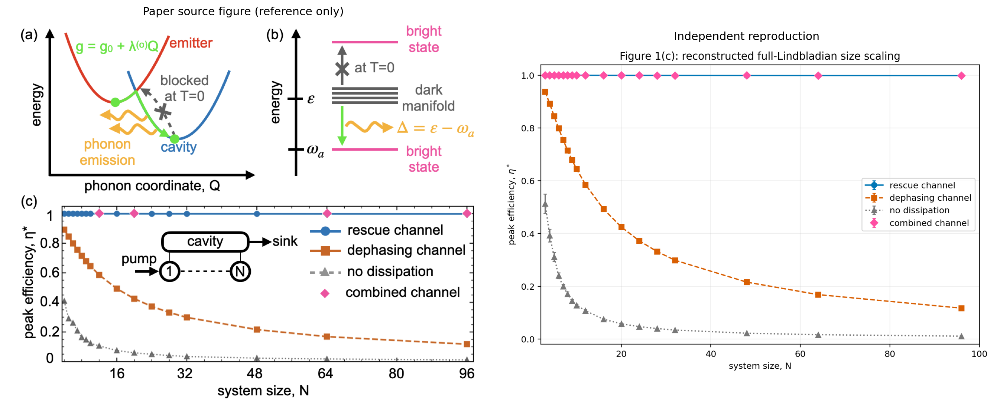

### Figure 2 comparison

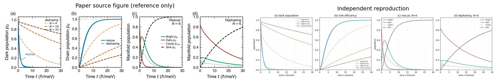

### Figure 3 comparison

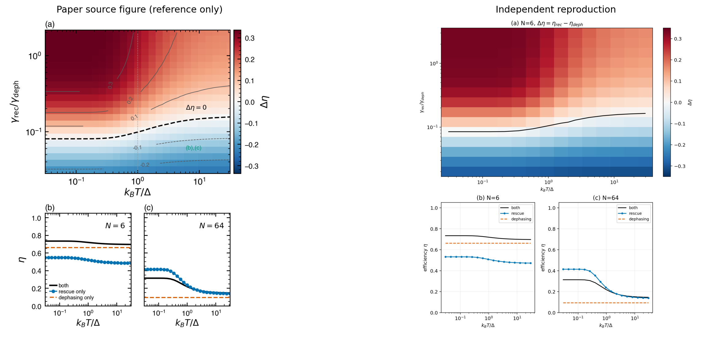

### Figure S1 comparison

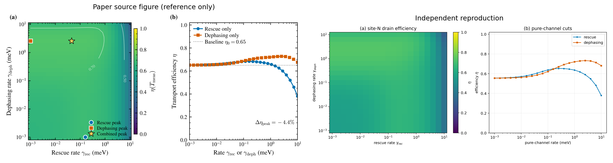

### Figure S2 comparison

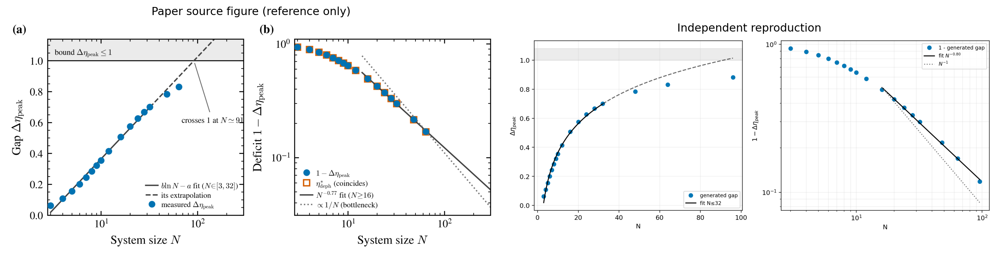

### Figure S3 comparison

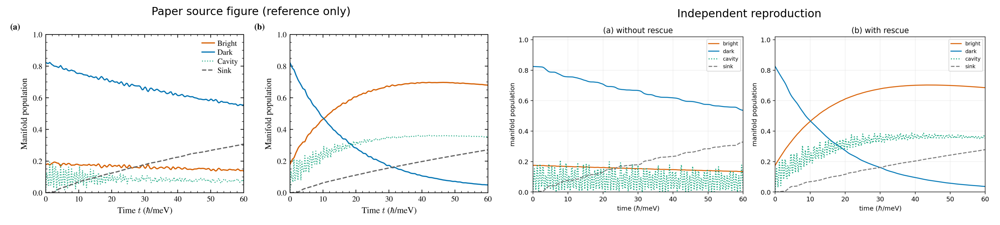

### Figure S4 comparison

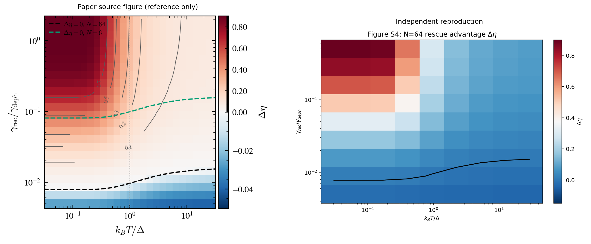

### Figure 1(c): Rescue stays above 0.998 through N=96; scaling slope 0.2871 versus 0.29

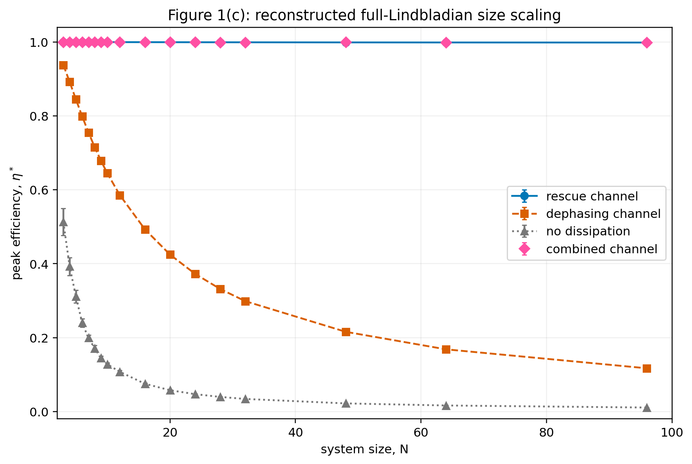

### Figure 2: Manifold-resolved dark-to-bright valve dynamics

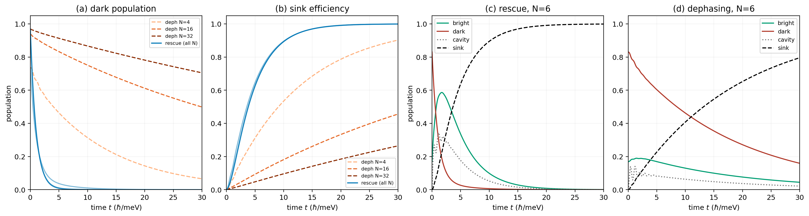

### Figure 3: N=6 finite-temperature mechanism boundary 0.0845 to 0.1629

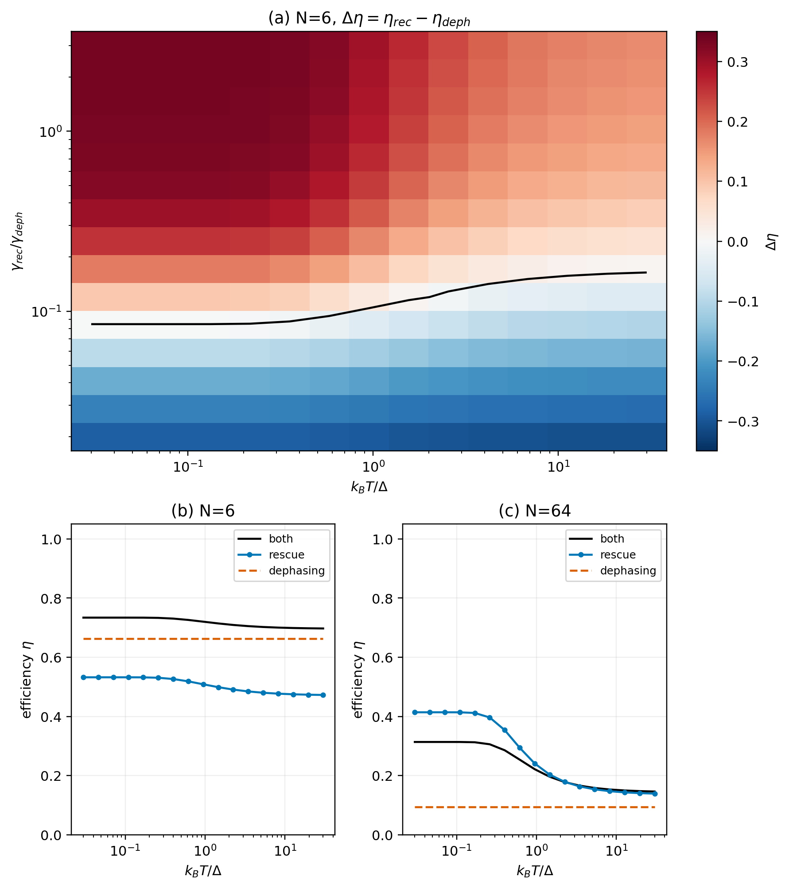

### Figure S1: Site-N drain reverses the rescue/dephasing ranking

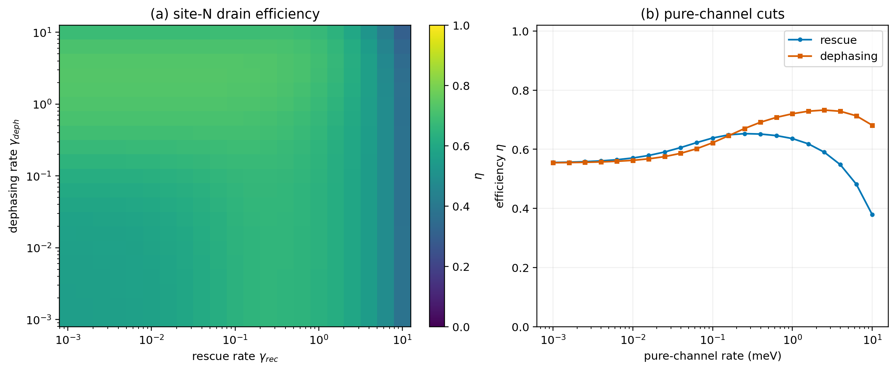

### Figure S2: Published logarithmic and power-law scaling features recovered

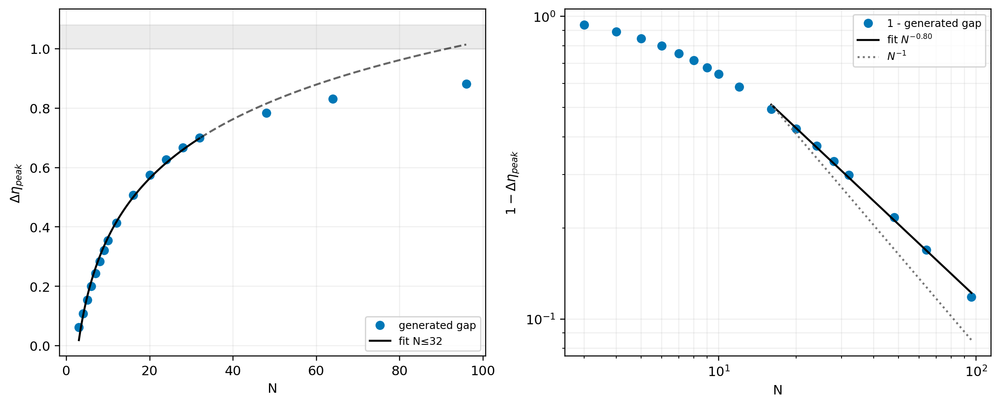

### Figure S3: Site-N manifold dynamics retain the rescue-specific bright transient

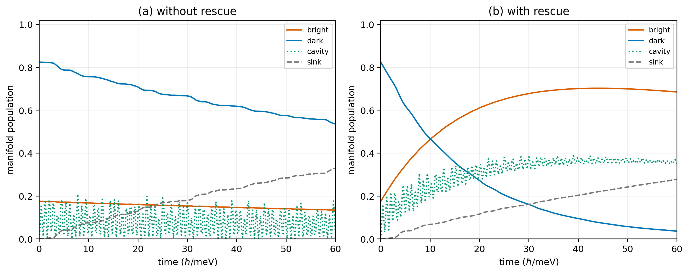

### Figure S4: Reduced-grid N=64 thermal boundary 0.00756 to 0.01497

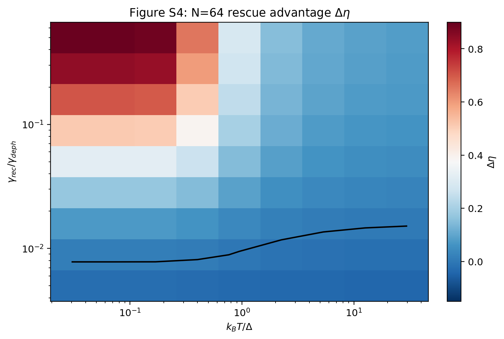

## Quick Run

```bash
python -m venv .venv
source .venv/bin/activate
pip install -r requirements.txt
cd cases/2608.05312/code
python scripts/run_checks.py
python scripts/run_reproduction.py --profile quick --targets all --output-root ../outputs/quick
```

### Declared paper-parameter-subset rerun

The paper-subset profile uses the paper's printed system sizes and rates, 15 to 20 disorder realizations for the main targets, paired seeds, adaptive log-rate scans, and a reduced five-realization 9x9 N=64 temperature map. The committed formal run took roughly eleven minutes on a 16 GiB Apple M4.

```bash
cd cases/2608.05312/code
python scripts/run_reproduction.py --profile paper_subset --targets all --output-root ../outputs/paper_subset
```

Generated files are kept under [data](outputs/data/), [figures](outputs/figures/), and [checks](outputs/checks/).

## Reproduction Boundary

This public case includes paper-derived code, generated data, generated figures, public validation checks, explanatory notes, and 7 limited comparison panels. Those panels use the minimum paper excerpts needed for validation and clearly separate the paper reference from the independent result. The case does not redistribute the paper PDF, arXiv source archive, standalone original figures, EPS paths, digitized source curves, or source-derived point sets.

Remaining limitation: This is not an author-data-level or paper-exact reproduction. The paper omits the mean hopping, exact source-state notation, author random seeds, and exact scan grids, so the results remain paper_subset. The N=64 temperature map uses five realizations on a 9x9 grid. The QCLE figure is blocked because the lead/bath matrices, chemical potentials, initial state, and runnable author implementation are not supplied.

Final-parameter rule: final public figures use the paper parameters when feasible. Any reduced-scale, subset, proxy, or blocked target must be labeled explicitly and cannot be presented as a complete reproduction.
