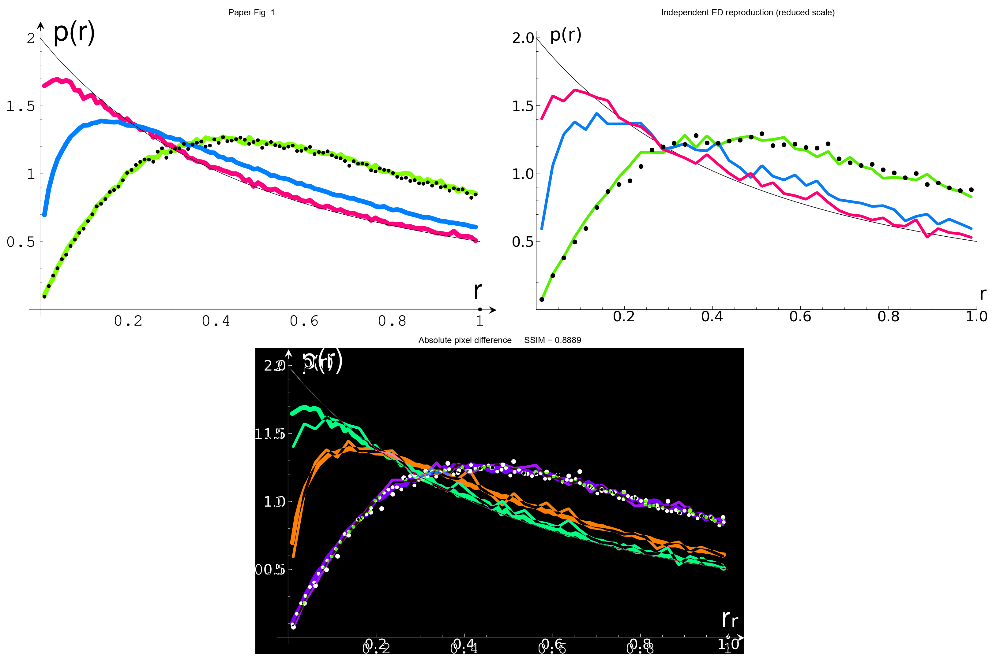
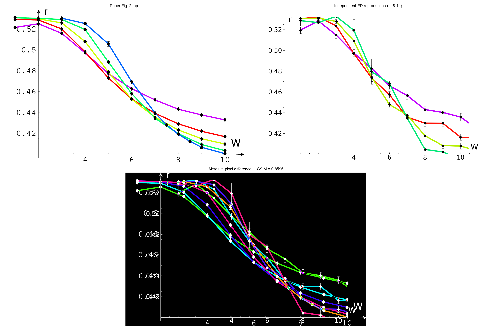
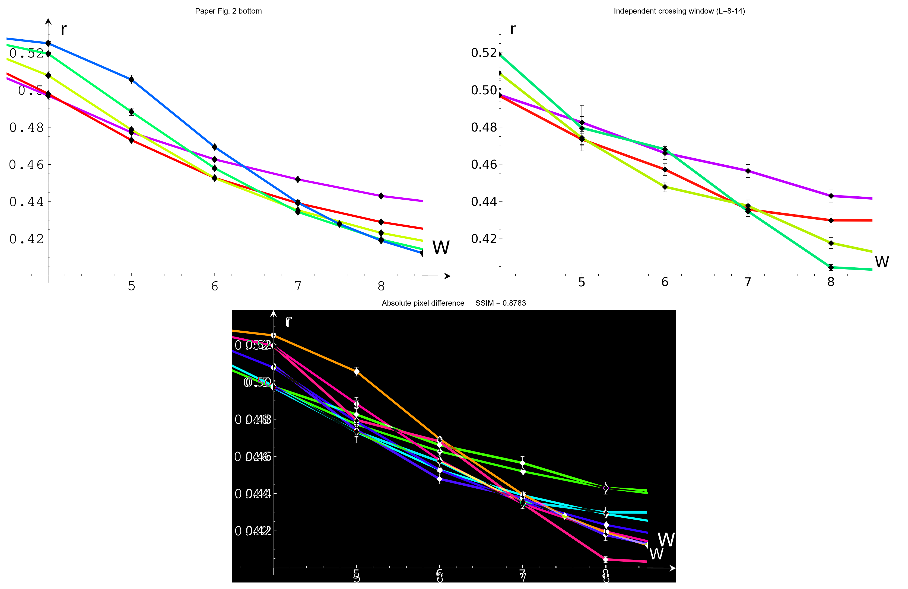
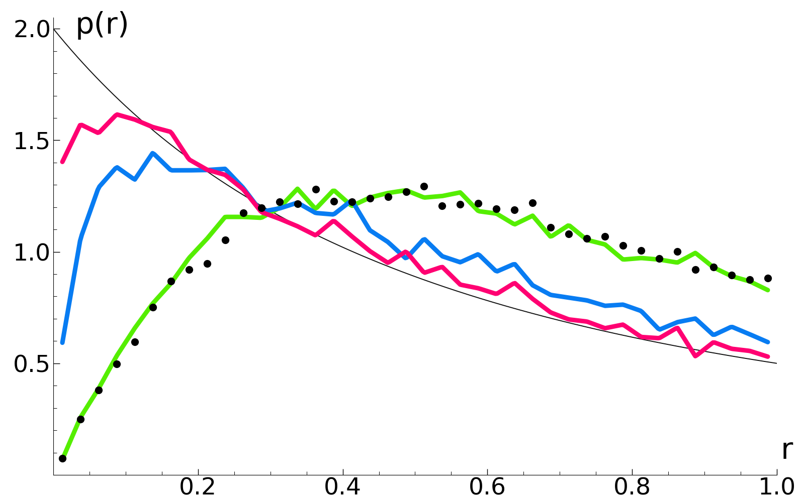
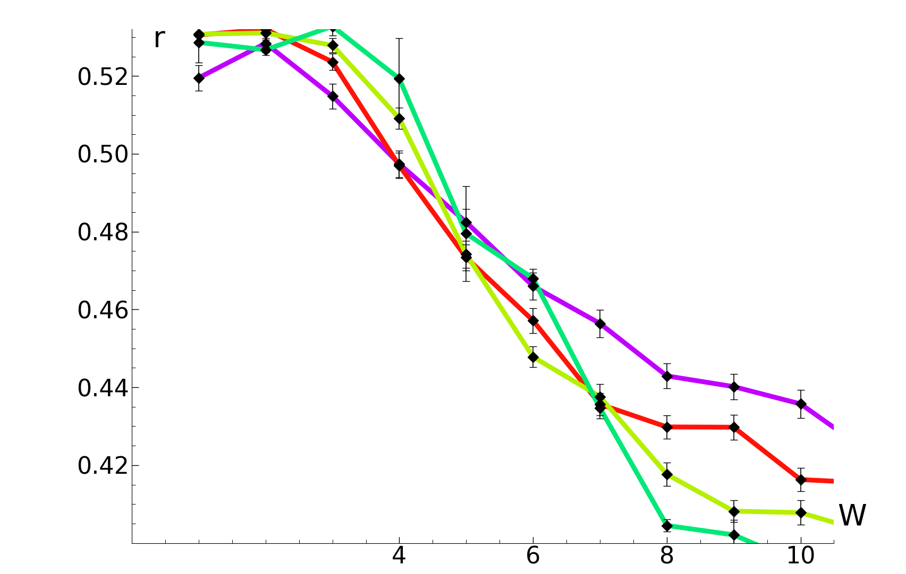
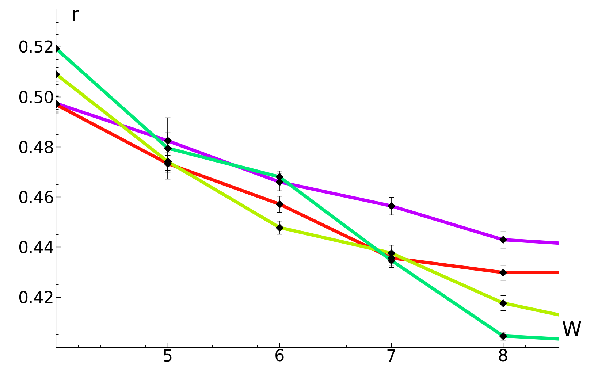

# cond-mat-0610854: Localization of Interacting Fermions at High Temperature

Preprint: [arXiv:cond-mat/0610854 — Localization of Interacting Fermions at High Temperature](https://arxiv.org/abs/cond-mat/0610854)

Published as: [Localization of Interacting Fermions at High Temperature](https://doi.org/10.1103/PhysRevB.75.155111)

Formal citation: Phys. Rev. B 75, 155111 (2007) · DOI `10.1103/PhysRevB.75.155111` · Locator `155111`

Public status: **Partial scientific reproduction** · Audit score: **70.00/100**

Clean-room scientific reproduction; author code and author numerical arrays are excluded from numerical inputs.

## Start Here / 从这里开始

- [中文复现 Note](note/reproduction-note.zh-CN.md)
- [English reproduction note](note/reproduction-note.en.md)
- [Equation-level derivation](docs/DERIVATION.md)
- [Numerical methods](docs/NUMERICAL_METHODS.md)
- [Public evidence index](docs/EVIDENCE_INDEX.md)
- [Comparison policy](docs/COMPARISON_POLICY.md)
- [Scientific consistency report](docs/CONSISTENCY_REPORT.md)
- [Paper review protocol](docs/PAPER_REVIEW_PROTOCOL_V2.md)
- [Code and run commands](code/README.md)
- [Machine-readable scorecard](outputs/checks/similarity_scorecard.json)
- [Machine-readable completion boundary](outputs/checks/completion_assessment.json)
- [Derivation (equations)](docs/DERIVATION.md)
- [Numerical methods](docs/NUMERICAL_METHODS.md)
- [Lessons learned](docs/LESSONS_LEARNED.md)

## Paper Reference vs Independent Reproduction

Each board contains only the minimum paper excerpt needed for validation and places it beside an independently generated result. Visual agreement is a scientific-region diagnostic, not author-data-level equivalence.

### T001 main fig1 comparison comparison



### T002 main fig2 top comparison comparison



### T003 main fig2 bottom comparison comparison



## Quick Run

```bash
python -m venv .venv
source .venv/bin/activate
pip install -r requirements.txt
cd cases/cond-mat-0610854/code
python scripts/run_reproduction.py --config config/reduced_scale.json
```

Generated files are kept under [data](outputs/data/), [figures](outputs/figures/), and [checks](outputs/checks/).

## Reproduction Boundary

This public case includes paper-derived code, generated data, generated figures, public validation checks, explanatory notes, and 3 limited comparison panels. Those panels use the minimum paper excerpts needed for validation and clearly separate the paper reference from the independent result. The case does not redistribute the paper PDF, arXiv source archive, standalone original figures, EPS paths, digitized source curves, or source-derived point sets.

Remaining limitation: Remaining lifecycle boundaries: artifact_integrity=artifact_valid_with_warnings, parameters=mixed, causal_resolution=terminal_blocker, pixel=passed_with_not_comparable, review_scope=incomplete, paper_assessment=reproduction_defect.

Final-parameter rule: final public figures use the paper parameters when feasible. Any reduced-scale, subset, proxy, or blocked target must be labeled explicitly and cannot be presented as a complete reproduction.

## Generated Figures






