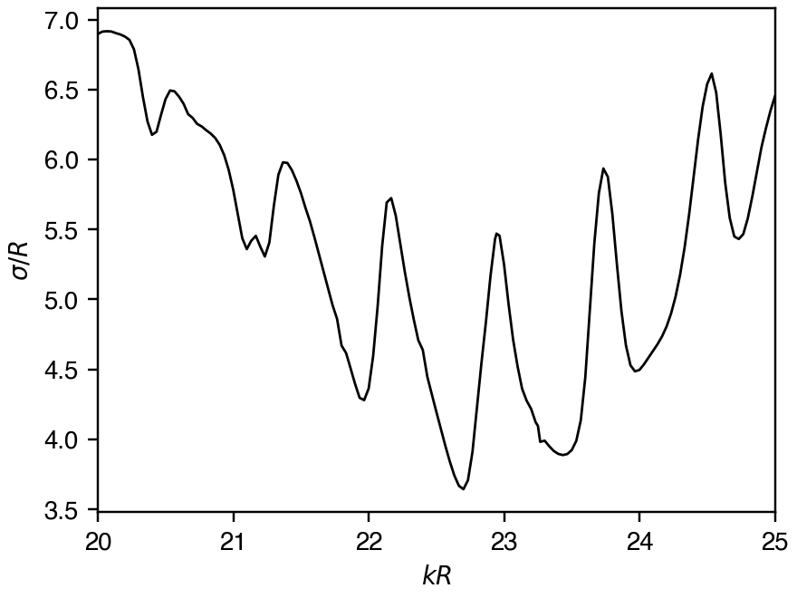
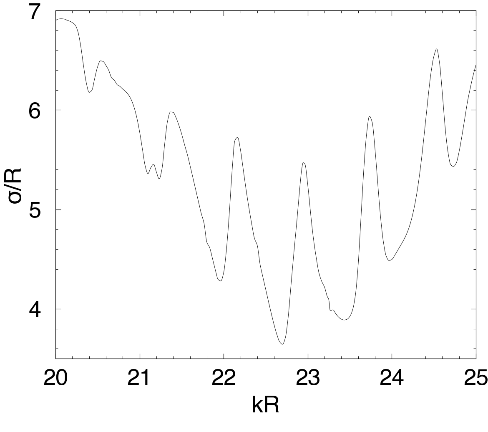
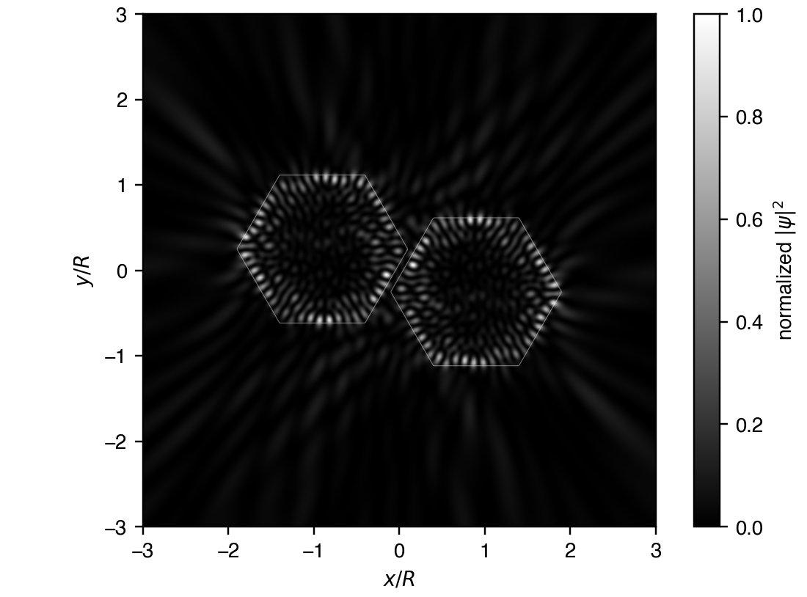
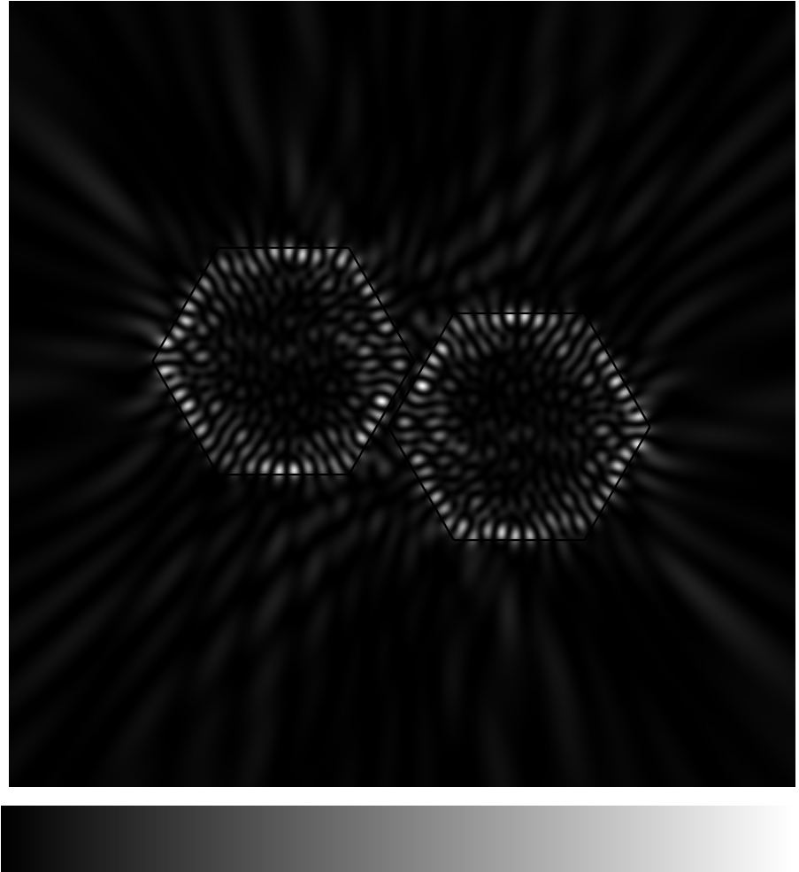
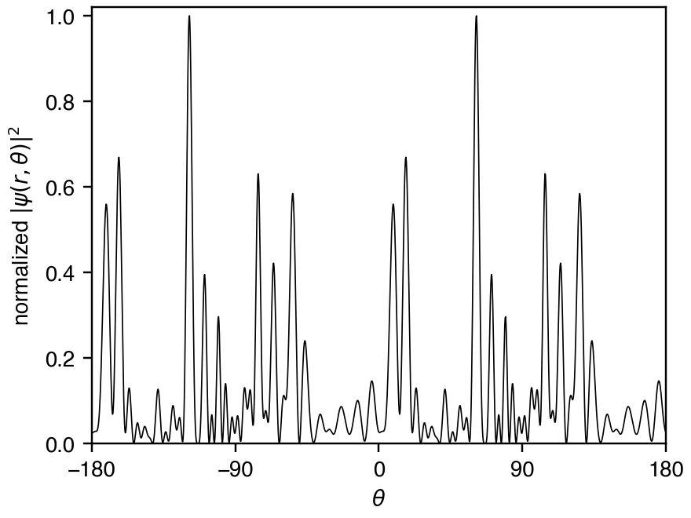
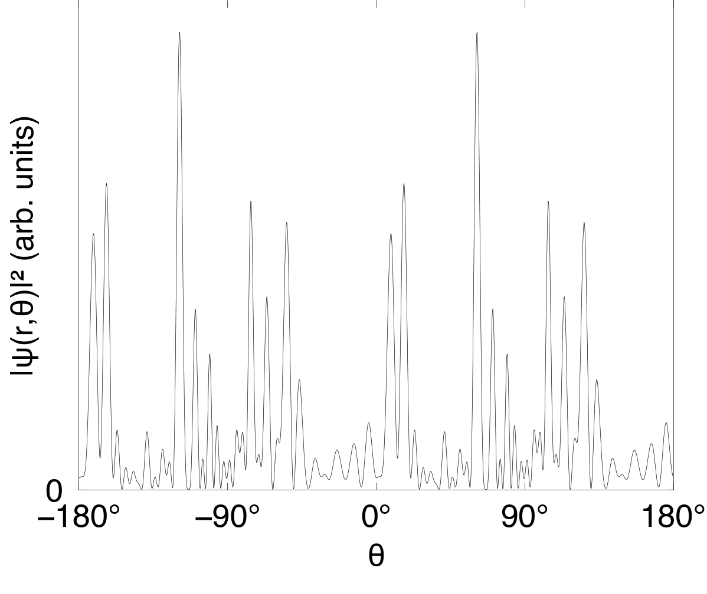

# physics-0206018: Boundary element method for resonances in dielectric microcavities

Preprint: [arXiv:physics/0206018 — Boundary element method for resonances in dielectric microcavities](https://arxiv.org/abs/physics/0206018)

Published as: [Boundary element method for resonances in dielectric microcavities](https://doi.org/10.1088/1464-4258/5/1/308)

Formal citation: 5, 53–60 (2003) · DOI `10.1088/1464-4258/5/1/308` · Locator `53-60`

Public status: **Partial scientific reproduction** · Audit score: **64.23/100**

All and only the paper's numerical figures (Figs. 5-7) were independently regenerated from the boundary-integral equations.

## Start Here / 从这里开始

- [中文复现 Note](note/reproduction-note.zh-CN.md)
- [English reproduction note](note/reproduction-note.en.md)
- [Equation-level derivation](docs/DERIVATION.md)
- [Numerical methods](docs/NUMERICAL_METHODS.md)
- [Public evidence index](docs/EVIDENCE_INDEX.md)
- [Comparison policy](docs/COMPARISON_POLICY.md)
- [Scientific consistency report](docs/CONSISTENCY_REPORT.md)
- [Independent paper assessment](docs/PAPER_ASSESSMENT.md)
- [Code and run commands](code/README.md)
- [Machine-readable scorecard](outputs/checks/similarity_scorecard.json)
- [Machine-readable completion boundary](outputs/checks/completion_assessment.json)
- [Derivation (equations)](docs/DERIVATION.md)
- [Numerical methods](docs/NUMERICAL_METHODS.md)
- [Lessons learned](docs/LESSONS_LEARNED.md)

## Quick Run

```bash
python -m venv .venv
source .venv/bin/activate
pip install -r requirements.txt
cd cases/physics-0206018/code
python scripts/run_reproduction.py --config config/feature.json
```

Published machine-readable artifacts are kept under [data](outputs/data/), [figures](outputs/figures/), [checks](outputs/checks/).

## Reproduction Boundary

This public case includes paper-derived code, generated data, generated figures, public validation checks, explanatory notes. It does not redistribute the paper PDF, arXiv source archive, original figures, EPS paths, digitized source curves, source-derived point sets, or source-vs-generated composite panels.

Remaining limitation: The attested production run uses the published N=1600 scale and passes the paper-declared rounding/discretization equivalence contract. The prose and Figure 4 disagree on the vertical displacement sign, so the figure-defined publication variant is paper_subset pending fresh review. Original figures are used only after numerical artifacts are frozen, for RenderContract and diagnostic comparison.

Final-parameter rule: final public figures use the paper parameters when feasible. Any reduced-scale, subset, proxy, or blocked target must be labeled explicitly and cannot be presented as a complete reproduction.

## Generated Figures












