# prlb-f37350e-063: Phase Transitions in Nonreciprocal Driven-Dissipative Condensates

Preprint: [arXiv:2502.05267v3 — Phase Transitions in Nonreciprocal Driven-Dissipative Condensates](https://arxiv.org/abs/2502.05267v3)

Published as: [Phase Transitions in Nonreciprocal Driven-Dissipative Condensates](https://doi.org/10.1103/gphr-d1bc)

Formal citation: Physical Review Letters 135, 123401 (2025) · DOI `10.1103/gphr-d1bc` · Locator `123401`

Public status: **Formula-driven numerical feature reproduction; 4 items deferred** · Audit score: **76.75/100**

Independently reconstructs the paper's lattice equations and reproduces the main numerical content of Main Figs. 1-6 and Supplemental Figs. S1, S2(a), and S3. All executed scientific checks pass; the calculation also identifies a factor-four inconsistency in the printed stability eigenvalue and two S1 caption offsets.

## Start Here / 从这里开始

- [中文复现 Note](note/reproduction-note.zh-CN.md)
- [English reproduction note](note/reproduction-note.en.md)
- [Full equation derivation](docs/DERIVATION.md)
- [Reproduction report](docs/REPRODUCTION_REPORT.md)
- [Target ledger](docs/TARGET_LEDGER.md)
- [Formula verification](docs/FORMULA_VERIFICATION.md)
- [Public provenance boundary](docs/SOURCE_AUDIT.md)
- [Pixel metrics](outputs/checks/pixel_metrics_summary.json)
- [Code and run commands](code/README.md)
- [Machine-readable scorecard](outputs/checks/similarity_scorecard.json)
- [Machine-readable completion boundary](outputs/checks/completion_assessment.json)
- [Derivation (equations)](docs/DERIVATION.md)
- [Numerical methods](docs/NUMERICAL_METHODS.md)
- [Lessons learned](docs/LESSONS_LEARNED.md)

## Main Reproduced Results

| Paper item | Reproduced result | Figure | Check |
| --- | --- | --- | --- |
| Main Fig. 2 | PBC traveling-wave existence and stability | [PNG](outputs/figures/main_fig2_pbc_stability_independent.png) | [JSON](outputs/checks/fast_formula_targets.json) |
| Main Fig. 3(b-e) | Static kink and dynamic frequency-wavevector locking | [PNG](outputs/figures/main_fig3_de_independent.png) | [JSON](outputs/checks/dynamic_targets.json) |
| Main Fig. 4(b-e) | Representative nonlinear edge and periodic dynamics | [PNG](outputs/figures/main_fig4_bcde_independent.png) | [JSON](outputs/checks/dynamic_targets.json) |
| Supplemental Fig. S1 | Critical-exceptional-point eigenvalue curves | [PNG](outputs/figures/supp_fig_s1_cep_independent.png) | [JSON](outputs/checks/cep_targets.json) |

## Paper Reference vs Independent Reproduction

Each board contains a limited scientific-region excerpt from the cited paper, an independently generated reproduction, and a rendering difference diagnostic. Paper pixels were never numerical inputs and the boards do not establish author-data-level equivalence.

### Main Fig. 1(b-d) comparison

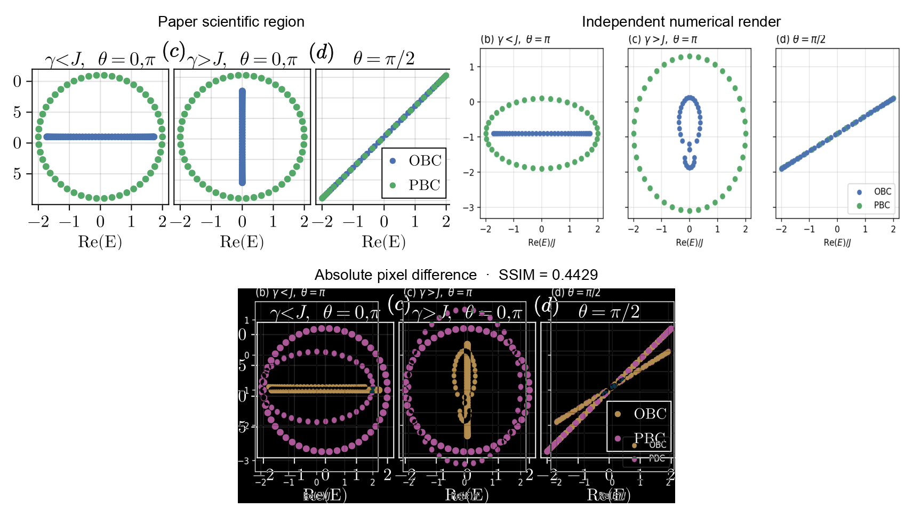

### Main Fig. 2 comparison

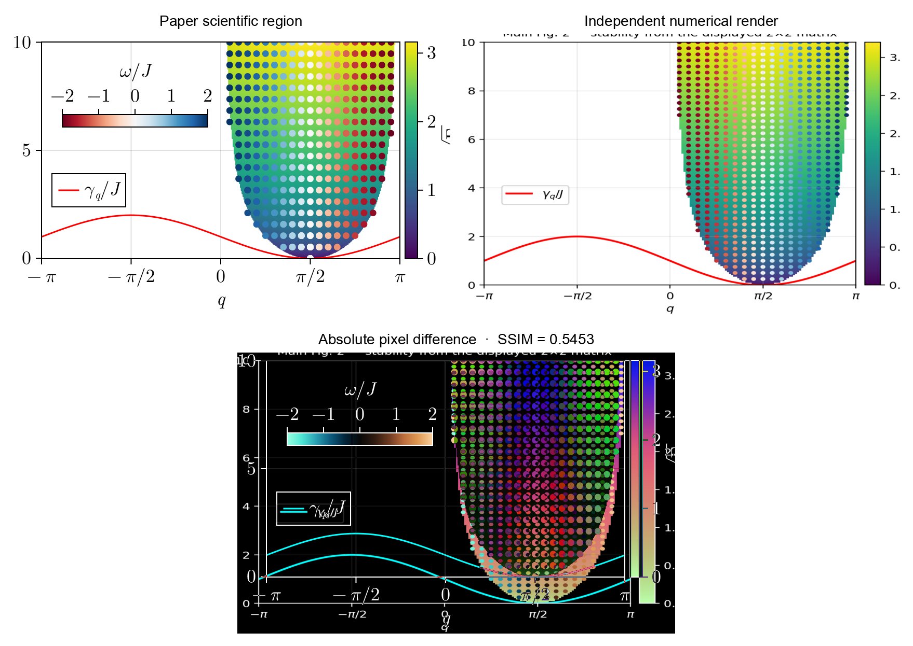

### Main Fig. 3(a) comparison

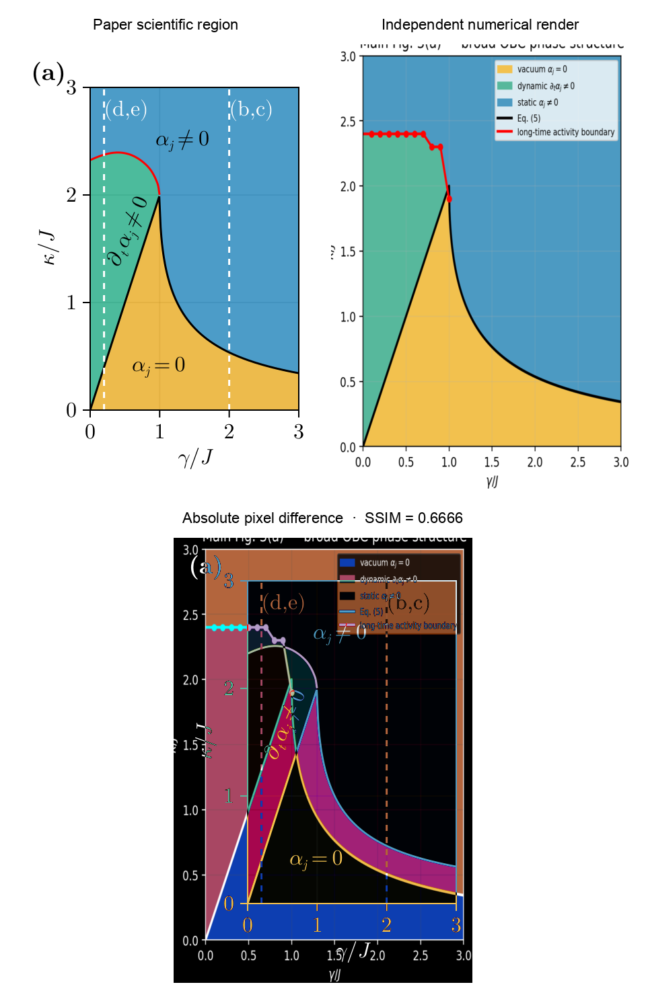

### Main Fig. 3(b,c) comparison

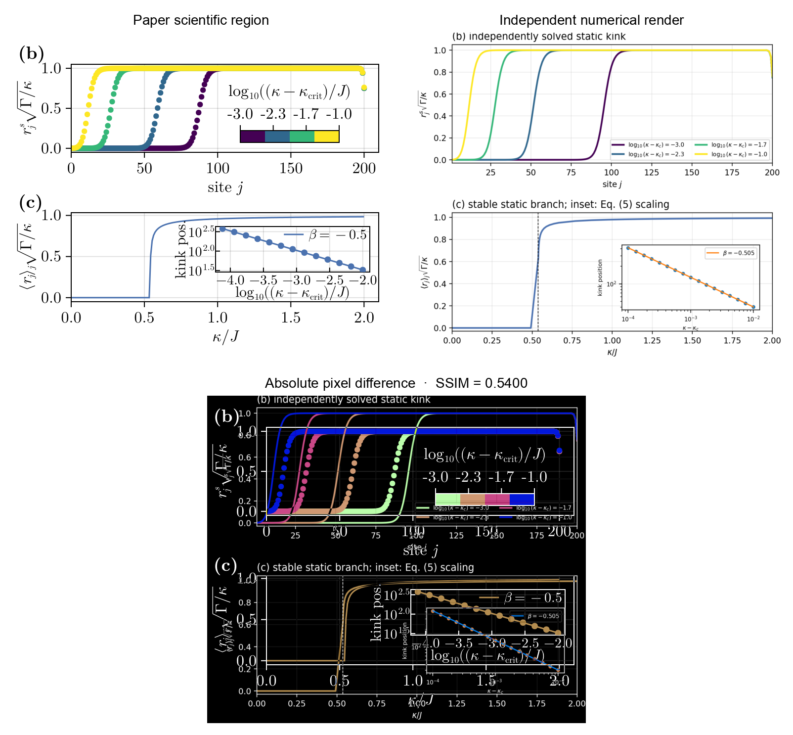

### Main Fig. 3(d,e) comparison

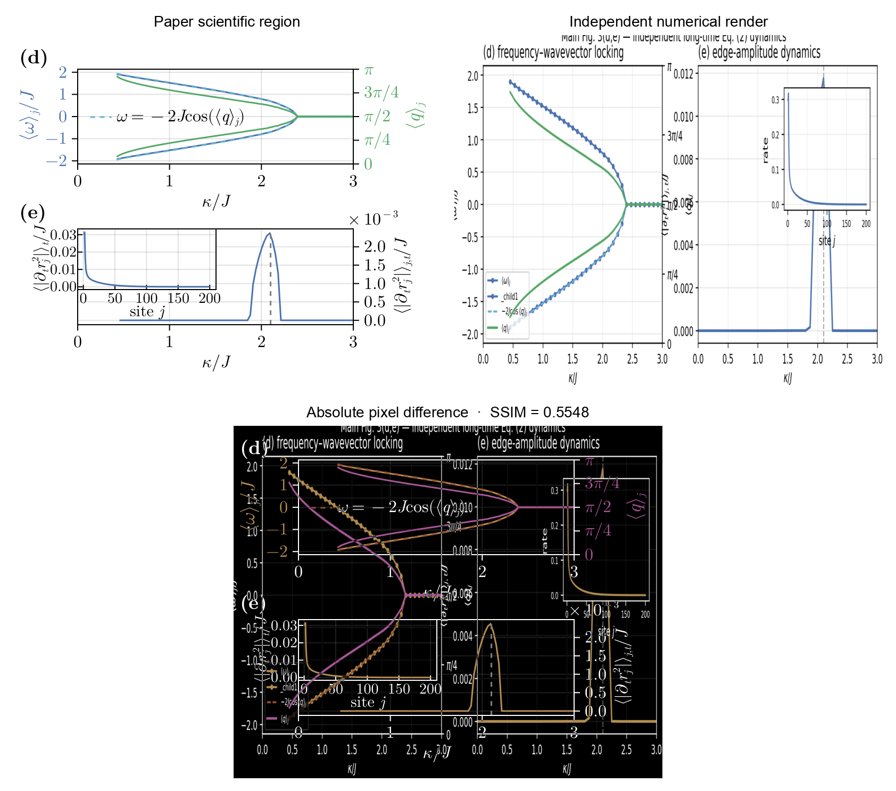

### Main Fig. 4(b-e) comparison

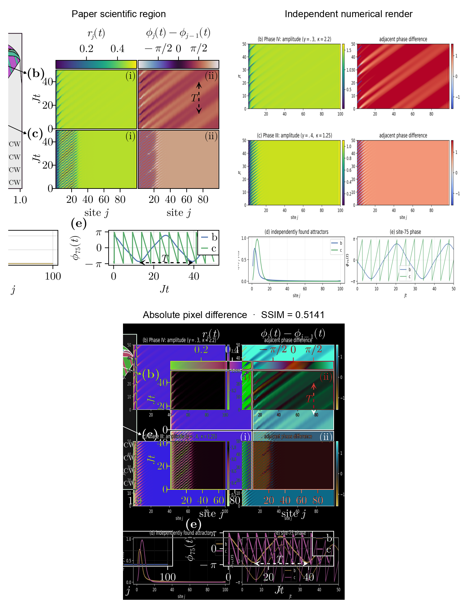

### End Matter Fig. 5 comparison

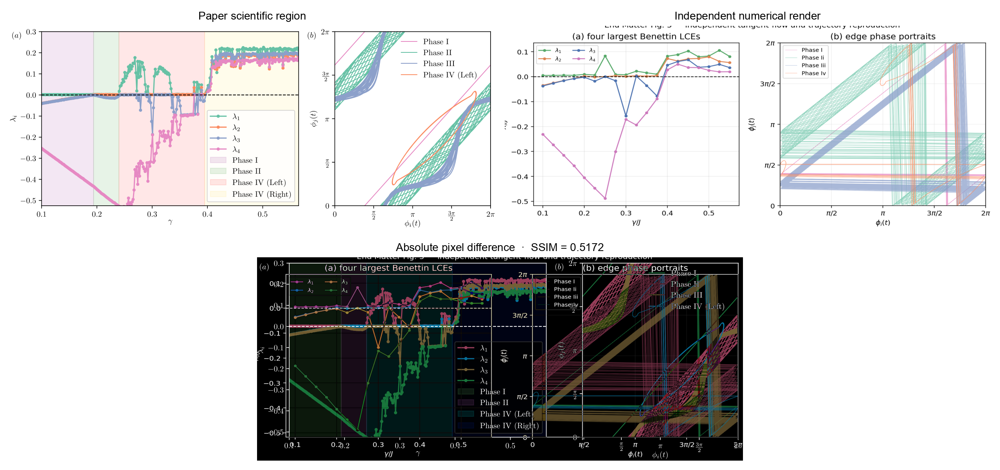

### End Matter Fig. 6 comparison

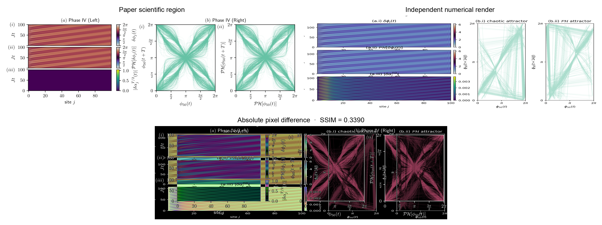

### Supplemental Fig. S1 comparison

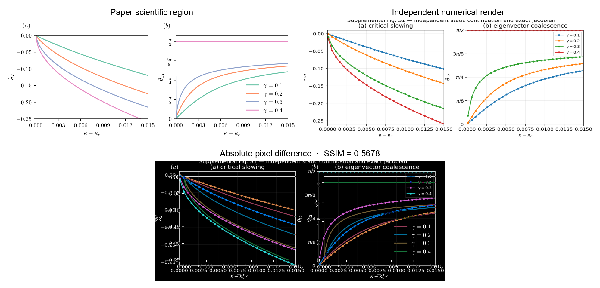

### Supplemental Fig. S2(a) comparison

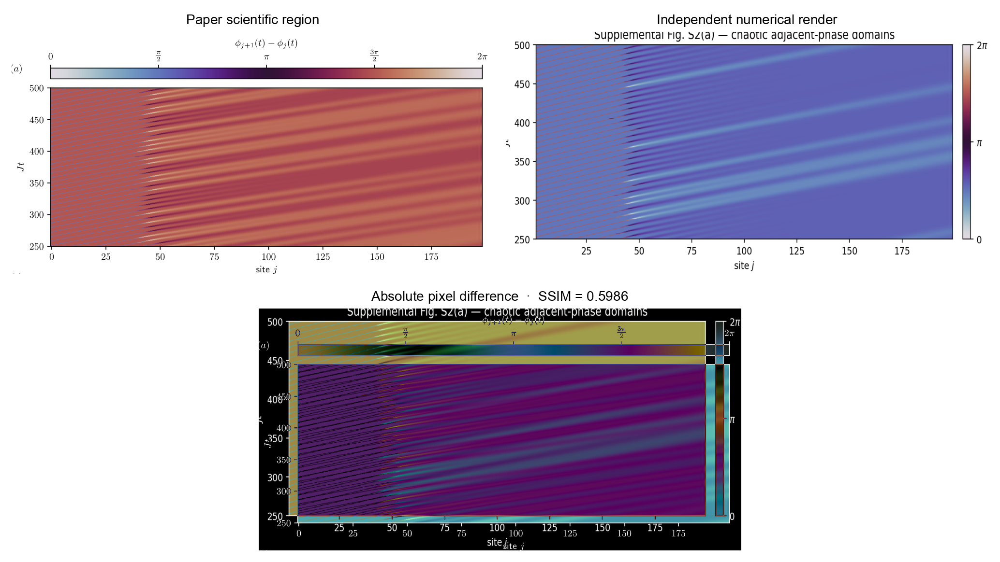

### Supplemental Fig. S3 comparison

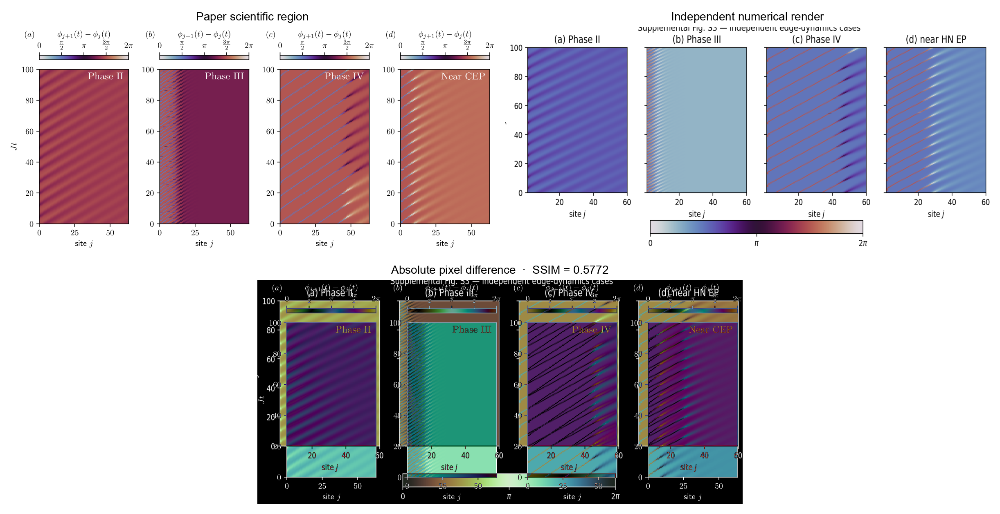

### Main Fig. 2: PBC traveling-wave existence and stability

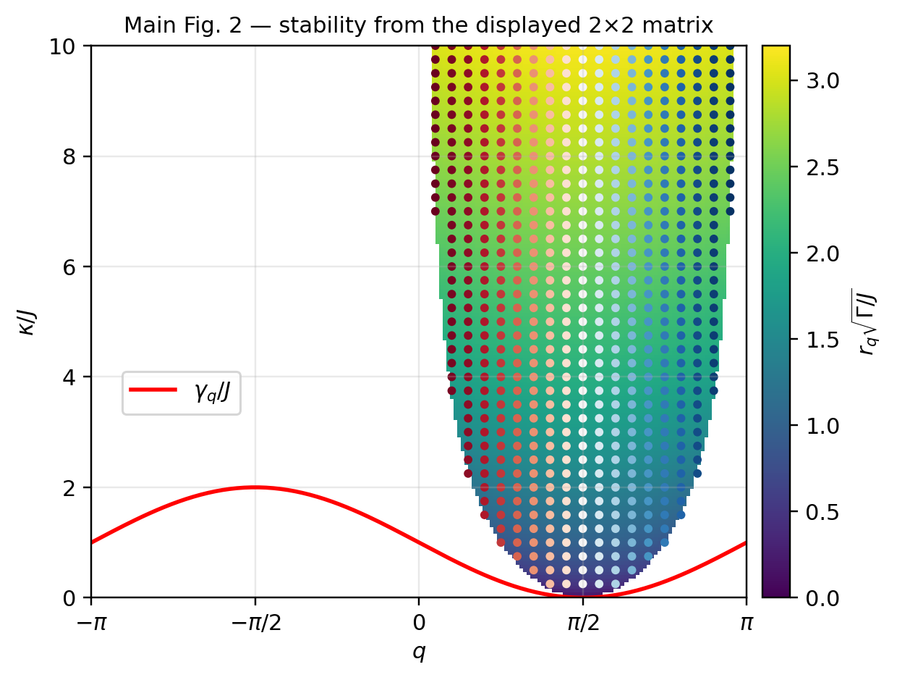

### Main Fig. 3(b-e): Static kink and dynamic frequency-wavevector locking

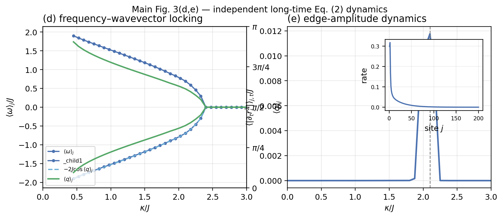

### Main Fig. 4(b-e): Representative nonlinear edge and periodic dynamics

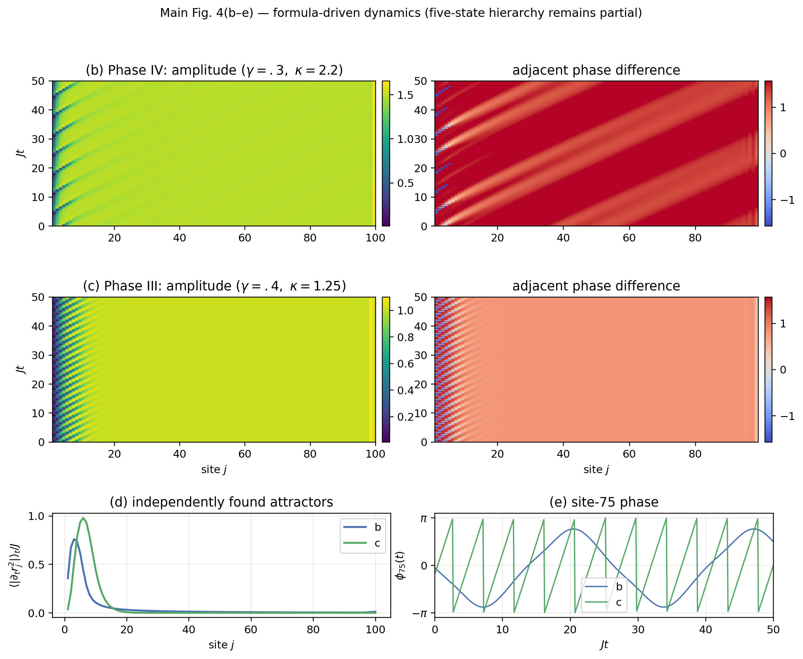

### Supplemental Fig. S1: Critical-exceptional-point eigenvalue curves

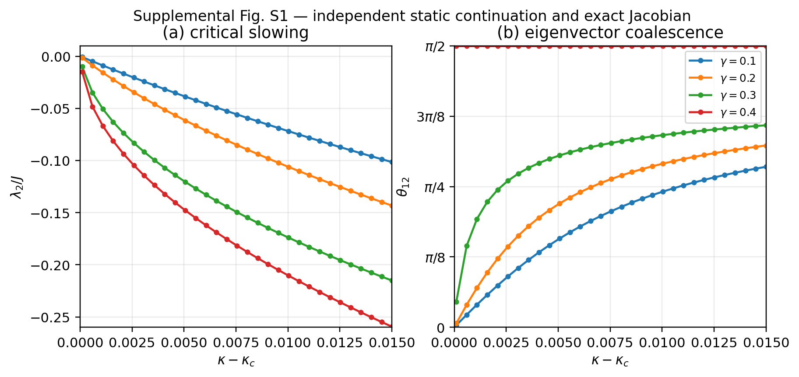

## Quick Run

```bash
python -m venv .venv
source .venv/bin/activate
pip install -r requirements.txt
cd cases/prlb-f37350e-063/code
python scripts/render_fast_formula_targets.py
python scripts/render_dynamic_targets.py
python scripts/render_cep_targets.py
python scripts/render_phase_diagram_targets.py
```

### Full paper-scale rerun

The implemented local campaign takes a few minutes and peaks near 2.2 GiB during the dynamic stage. It recomputes the published independent arrays and figures, but it does not close the four explicitly deferred paper items.

```bash
cd cases/prlb-f37350e-063/code
python scripts/run_fast_formula_targets.py
python scripts/run_dynamic_targets.py
python scripts/run_cep_targets.py
python scripts/run_phase_diagram_targets.py
python scripts/render_fast_formula_targets.py
python scripts/render_dynamic_targets.py
python scripts/render_cep_targets.py
python scripts/render_phase_diagram_targets.py
```

Generated files are kept under [data](outputs/data/), [figures](outputs/figures/), and [checks](outputs/checks/).

## Reproduction Boundary

This public case includes paper-derived code, generated data, generated figures, public validation checks, explanatory notes, and 11 limited comparison panels. Those panels use the minimum paper excerpts needed for validation and clearly separate the paper reference from the independent result. The case does not redistribute the paper PDF, arXiv source archive, standalone original figures, EPS paths, digitized source curves, or source-derived point sets.

Remaining limitation: This is an in-progress partial full-paper reproduction. The paper-resolution Fig. 3(a) boundary, Fig. 4(a) fine multistable stripes, Fig. 4(d) five-attractor hierarchy, and Supplemental Fig. S2(b) 300-trajectory ensemble remain deferred; not every target has final isolated-run and independent-review evidence.

Final-parameter rule: final public figures use the paper parameters when feasible. Any reduced-scale, subset, proxy, or blocked target must be labeled explicitly and cannot be presented as a complete reproduction.
