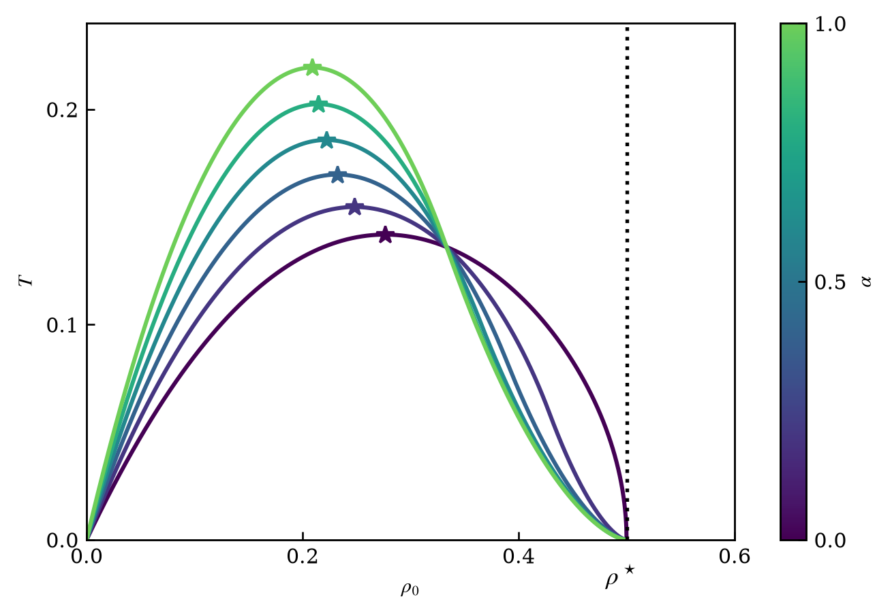
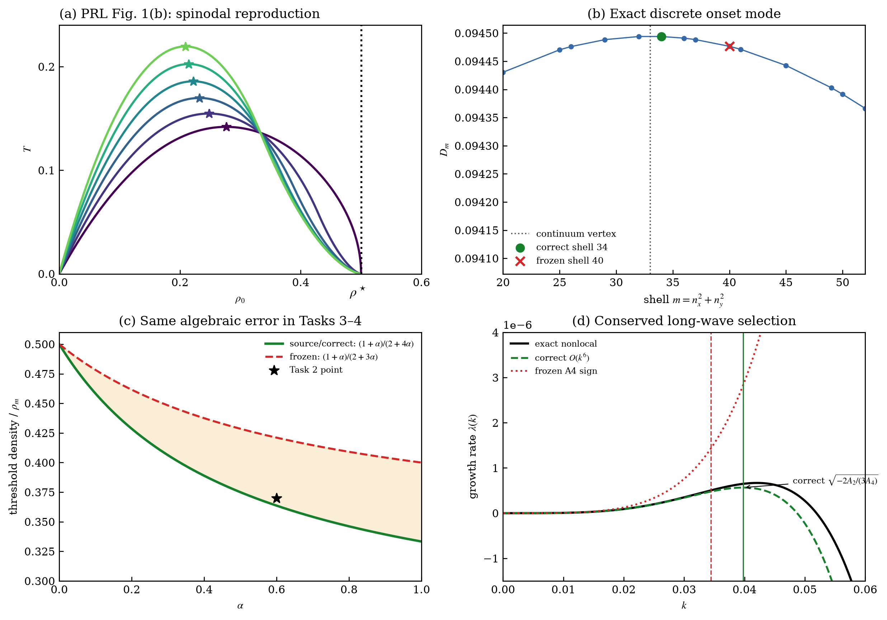

# prlb-f37350e-100: Hydrodynamics of Cooperation and Self-Interest in a Two-Population Occupation Model

Preprint: **No preprint recorded as of 2026-08-04**

Published as: [Hydrodynamics of Cooperation and Self-Interest in a Two-Population Occupation Model](https://doi.org/10.1103/3bj7-jc92)

Formal citation: Physical Review Letters 135, 107402 (2025) · DOI `10.1103/3bj7-jc92` · Locator `107402`

Public status: **Historical scientific artifact (2 numerical targets; 1 failed, 1 reproduced)** · Audit score: **0.00/100**

Publishes the independently generated numerical artifacts retained by the historical case: 2 public generated data files, 2 public generated figures, and 2 declared numerical targets. The package preserves failed, partial, proxy, and unresolved outcomes instead of upgrading them to completion.

## Start Here / 从这里开始

- [中文复现 Note](note/reproduction-note.zh-CN.md)
- [English reproduction note](note/reproduction-note.en.md)
- [Code and run commands](code/README.md)
- [Machine-readable scorecard](outputs/checks/similarity_scorecard.json)
- [Derivation (equations)](docs/DERIVATION.md)
- [Numerical methods](docs/NUMERICAL_METHODS.md)
- [Lessons learned](docs/LESSONS_LEARNED.md)

## Main Reproduced Results

| Paper item | Reproduced result | Figure | Check |
| --- | --- | --- | --- |
| PRL_FIG1B | Homogeneous-state spinodal temperature versus density for six altruistic fractions. | [PNG](outputs/figures/idx100_spinodal_reproduction.png) | [JSON](outputs/checks/similarity_scorecard.json) |
| BENCH_AUDIT | Independent audit of all idx100 analytic and numerical claims. | [PNG](outputs/figures/idx100_gold_audit.png) | [JSON](outputs/checks/similarity_scorecard.json) |

### PRL_FIG1B: Homogeneous-state spinodal temperature versus density for six altruistic fractions.



### BENCH_AUDIT: Independent audit of all idx100 analytic and numerical claims.



## Quick Run

```bash
python -m venv .venv
source .venv/bin/activate
pip install -r requirements.txt
cd cases/prlb-f37350e-100/code
python scripts/verify_public_artifacts.py
```

Generated files are kept under [data](outputs/data/), [figures](outputs/figures/), and [checks](outputs/checks/).

## Reproduction Boundary

This public case includes paper-derived code, generated data, generated figures, public validation checks, and explanatory notes. It does not redistribute the paper PDF, arXiv source archive, original figures, EPS paths, digitized source curves, source-derived point sets, or source-vs-generated composite panels.

Remaining limitation: Frozen non-final target states: T_GOLD_AUDIT=failed. The legacy case has no machine-verifiable author-code isolation attestation. No source-image comparison panel or digitized source curve is published in this projection.

Final-parameter rule: final public figures use the paper parameters when feasible. Any reduced-scale, subset, proxy, or blocked target must be labeled explicitly and cannot be presented as a complete reproduction.
