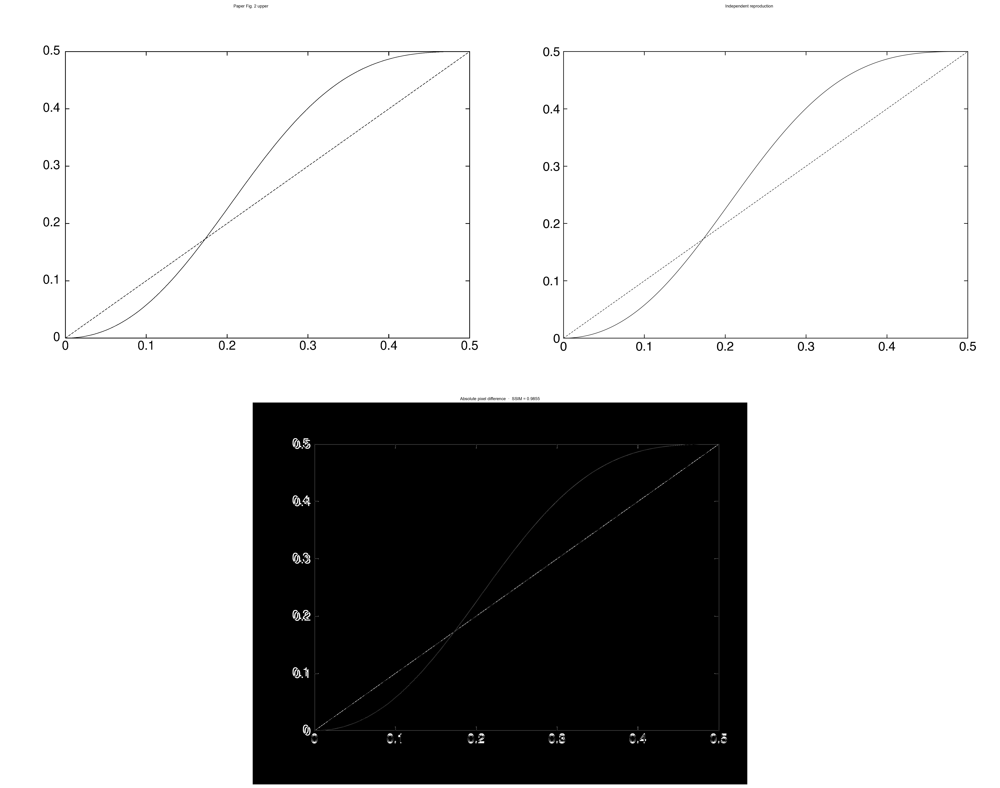
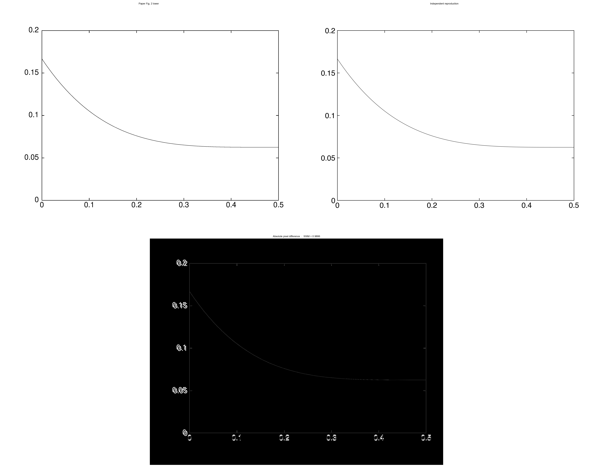
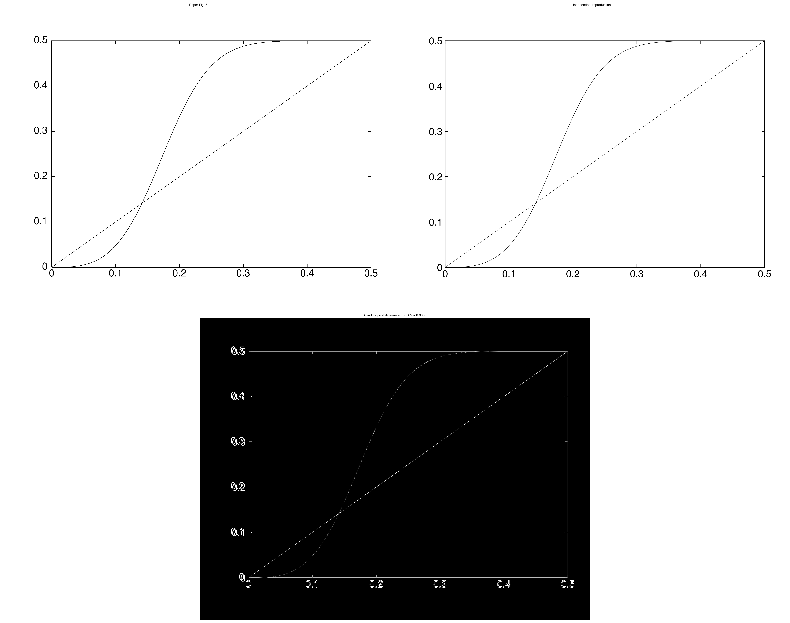
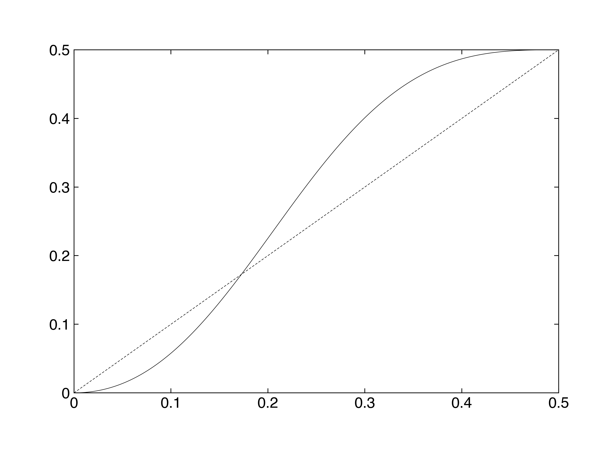
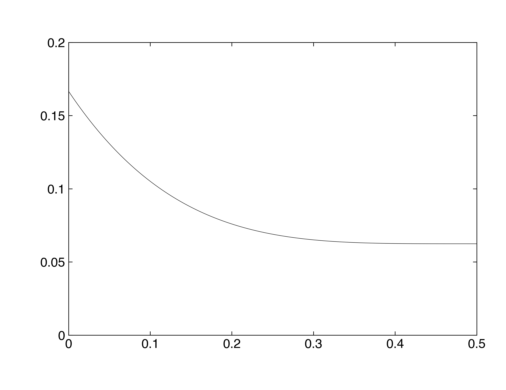
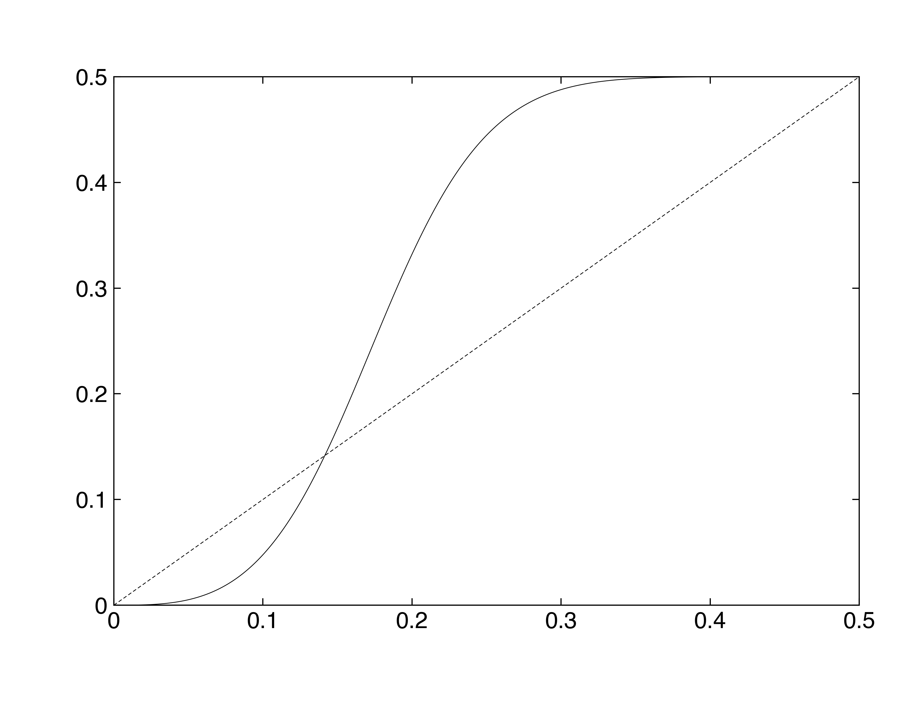

# quant-ph-0403025: Universal Quantum Computation with Ideal Clifford Gates and Noisy Ancillas

Preprint: [arXiv:quant-ph/0403025 — Universal Quantum Computation with Ideal Clifford Gates and Noisy Ancillas](https://arxiv.org/abs/quant-ph/0403025)

Published as: [Universal quantum computation with ideal Clifford gates and noisy ancillas](https://doi.org/10.1103/PhysRevA.71.022316)

Formal citation: Phys. Rev. A 71, 022316 (2005) · DOI `10.1103/PhysRevA.71.022316` · Locator `71, 022316`

Public status: **Partial scientific reproduction** · Audit score: **90.00/100**

The manuscript source archive contains TeX and four EPS figures, but no computational code or numerical arrays.

## Start Here / 从这里开始

- [中文复现 Note](note/reproduction-note.zh-CN.md)
- [English reproduction note](note/reproduction-note.en.md)
- [Equation-level derivation](docs/DERIVATION.md)
- [Numerical methods](docs/NUMERICAL_METHODS.md)
- [Public evidence index](docs/EVIDENCE_INDEX.md)
- [Comparison policy](docs/COMPARISON_POLICY.md)
- [Scientific consistency report](docs/CONSISTENCY_REPORT.md)
- [Paper review protocol](docs/PAPER_REVIEW_PROTOCOL_V2.md)
- [Code and run commands](code/README.md)
- [Machine-readable scorecard](outputs/checks/similarity_scorecard.json)
- [Machine-readable completion boundary](outputs/checks/completion_assessment.json)
- [Derivation (equations)](docs/DERIVATION.md)
- [Numerical methods](docs/NUMERICAL_METHODS.md)
- [Lessons learned](docs/LESSONS_LEARNED.md)

## Paper Reference vs Independent Reproduction

Each board contains only the minimum paper excerpt needed for validation and places it beside an independently generated result. Visual agreement is a scientific-region diagnostic, not author-data-level equivalence.

### T001 main fig2a source vs reproduction comparison



### T002 main fig2b source vs reproduction comparison



### T003 main fig3 source vs reproduction comparison



## Quick Run

```bash
python -m venv .venv
source .venv/bin/activate
pip install -r requirements.txt
cd cases/quant-ph-0403025/code
python scripts/run_reproduction.py --config config/paper_exact.json --output-root outputs/public_quick_run
```

Generated files are kept under [data](outputs/data/), [figures](outputs/figures/), and [checks](outputs/checks/).

## Reproduction Boundary

This public case includes paper-derived code, generated data, generated figures, public validation checks, explanatory notes, and 3 limited comparison panels. Those panels use the minimum paper excerpts needed for validation and clearly separate the paper reference from the independent result. The case does not redistribute the paper PDF, arXiv source archive, standalone original figures, EPS paths, digitized source curves, or source-derived point sets.

Remaining limitation: Author EPS/PDF pixels are comparison-only and never feed the numerical runner. All three numerical panels passed paper-exact science, isolated execution, and scientific-region render acceptance; fresh-context review remains pending.

Final-parameter rule: final public figures use the paper parameters when feasible. Any reduced-scale, subset, proxy, or blocked target must be labeled explicitly and cannot be presented as a complete reproduction.

## Generated Figures






