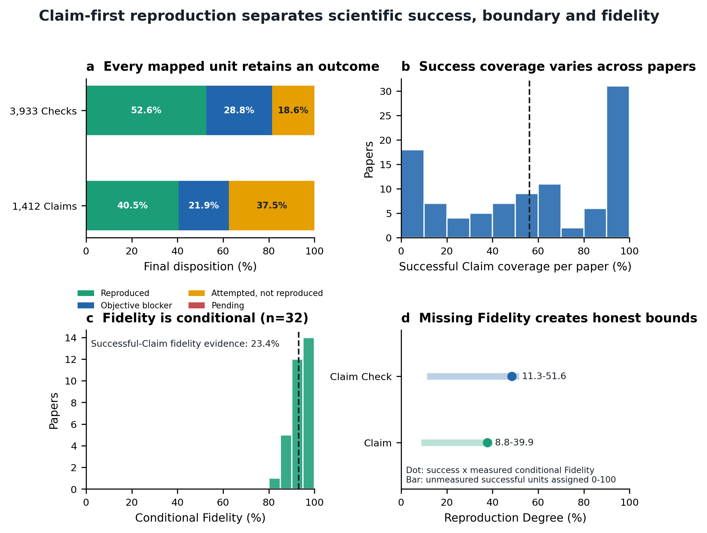

# Claim-first audit of 100 physics-paper reproductions

This directory is the frozen public evaluation package for the 100-paper
RunThePaper cohort. It measures how far the scientific Claims were reproduced;
it does **not** claim that all 100 papers were completely reproduced.

## Result snapshot

| Level | Final resolution | Successful reproduction | Objective blocker | Attempted, not reproduced | Conditional Fidelity | Fidelity evidence coverage | Reproduction Degree |
| --- | ---: | ---: | ---: | ---: | ---: | ---: | ---: |
| Claim Check | 100.00% | 52.58% | 28.83% | 18.59% | 92.16/100 | 23.26% | 48.46/100 |
| Numerical Claim, equal weight | 100.00% | 40.55% | 21.93% | 37.52% | 92.97/100 | 23.37% | 37.70/100 |

The fixed population contains 100 papers, 1,427 authored Claims and 3,933
Claim Checks. All 3,933 Checks have one verified direct Claim mapping and one
terminal disposition: 2,068 were reproduced, 1,134 were objectively blocked,
731 were attempted but not reproduced, and none remained pending.



## Measurement model

- A **Claim** is a falsifiable scientific statement in a paper.
- A **Claim Check** is the smallest independently assessable numerical or
  analytic observation used to test one direct Claim.
- A **Target** is the execution contract that generates evidence for one or
  more Checks.
- A reproduced Check has passed its scientific evidence requirements.
- An objective blocker requires a documented external limitation, a direct and
  root cause, and evidence that a reproduction-code defect is not the cause.
- Attempted but not reproduced means the agent-side path was available and was
  tried, but the paper result was not established. It is never relabelled as an
  external blocker merely to improve the score.

Each numerical Claim receives equal corpus weight. Within a Claim, successful
coverage is the fraction of its directly mapped Checks that were reproduced.
This prevents papers with many panels or diagnostic Checks from dominating the
headline result.

## Fidelity and the optional combined metric

Fidelity is admitted only after scientific reproduction and only when a
lifecycle-valid `scientific_region_v1` comparison exists between the paper
region and an independently generated render. Paper pixels may inform layout,
but they are not numerical inputs. Missing Fidelity is never guessed, copied
from another Check, or set to zero.

The optional communication metric is

```text
Reproduction Degree = successful Claim coverage × conditional Fidelity / 100
```

It must be reported with both raw components and Fidelity evidence coverage.
At Claim level, the conditional point estimate is 37.70/100 and the strict
no-imputation interval is 8.81--39.88/100. The interval assigns all unmeasured
successful mass Fidelity 0 or 100, respectively.

## Claims without a numerical Check

Fifteen Claims are handled outside numerical Fidelity. Eleven are pure-theory
Claims: five were verified by a derivation or invariant and six received
partial formula verification. Four experimental, external-validation or
meta-level Claims are explicitly excluded from numerical Fidelity rather than
being assigned an invented pixel score.

## Files

- [English manuscript](manuscript/main.pdf)
- [Supplementary Information](manuscript/supplementary.pdf)
- [Manuscript claim-to-evidence map](manuscript/CLAIM_EVIDENCE.md)
- [Headline metrics and provenance](data/summary.json)
- [All 3,933 Checks](data/checks.csv)
- [All 1,427 Claims](data/claims.csv)
- [All 100 paper rows](data/papers.csv)
- [All 1,134 objective blockers](data/externally_blocked_checks.csv)
- [All 731 attempted failures](data/attempted_not_reproduced_checks.csv)
- [All 15 non-numerical-Check Claims](data/non_numeric_claims.csv)
- [Optional render-only pixel-evidence queue](data/pixel_evidence_queue.csv)
- [Human-readable metric report](data/report.md)
- [Figure source data](source-data/)
- `python evaluation/claim-first-100/validate.py` verifies table counts,
  dispositions and every output hash recorded in `summary.json`.

The numerical rerun and unresolved queues are empty in this frozen evaluation.
The 346-row pixel-evidence queue is optional render-only work for already
reproduced Targets; it is not missing scientific execution and cannot alter
their numerical arrays.

## Provenance and interpretation boundary

The scientific input is frozen at PRAgent revision
`09ab3fb65c5dc2d2cf05a4fbf3c8a42b4d4de5f5`. The cohort identity was selected
at RunThePaper revision `6f1f8a57f75edaef17f9ff817a6aef0bbfc226da` and the
refreshed 100-case public projection is frozen in commit `2674ff1`.
`data/summary.json` records input and output hashes.

Accurate statement: all 3,933 Checks have complete mapping and terminal
accounting, while equal-weight numerical-Claim success coverage is 40.55%.

Inaccurate statement: all 100 papers were fully reproduced.
